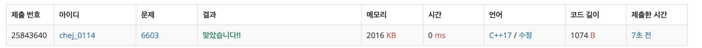

## 문제
- 백준 6603 : 로또
- 부르트포스
- https://www.acmicpc.net/problem/6603

<br/>

## 풀이
- 로또의 모든 조합을 출력해야 하는 재귀 부르트포스 문제이다.
- 재귀 함수는 6개 모두 선택한 경우, 더 이상 선택할 수 없는 경우 종료되어야 한다.
- 재귀 함수 호출시, index 번 째를 고른 경우와 고르지 않은 경우 모두 적절히 처리해 호출해야 한다.

<br/>

## 코드

```c++
#include <iostream>
#include <vector>

using namespace std;

vector<int> lotto; // 함수가 선택한 수 저장

void solve(vector<int> &vec, int index, int cnt){
    // 6개 모두 선택한 경우 -> 출력 후 종료
    if(cnt==6){
        for(int num: lotto){
            cout << num << " ";
        }
        cout << '\n';
        return;
    }
    
    // 더 이상 선택할 수 없는 경우 -> 종료
    int n = vec.size();
    if(n == index) return;
    
    // 재귀 호출 - index 번 째를 고른 경우
    lotto.push_back(vec[index]);
    solve(vec, index+1, cnt+1);
    
    // 재귀 호출 - index 번 째를 고르지 않은 경우
    lotto.pop_back();
    solve(vec, index+1, cnt);
}

int main(void){
    
    ios::sync_with_stdio(false);
    cin.tie(0); cout.tie(0);
    
    while(true){
        int k;
        cin >> k;
        
        if(k==0) break;
        vector<int> vec(k);
        
        for(int i=0; i<k; i++){
            cin >> vec[i];
        }
        
        solve(vec, 0, 0);
        cout << '\n';
    }
    
    return 0;
}

```

<br/>

## screenshot

