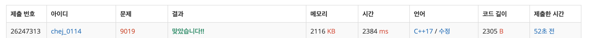

## 문제
- 백준 9019 : DSLR
- BFS
- https://www.acmicpc.net/problem/9019

<br/>

## 풀이

- `dist[]` : 그 동안 탐색하며 지나온 거리 저장
- `from[]` : 어떤 수로부터 만들어 졌는지 저장
- `how[]` : 어떻게 만들었는지 저장 (D, S, L, R). 어떠한 과정을 거쳤는지 저장한다.
- `visited` : 방문 여부 표시

간단해 보이지만..! 생각보다 간단하지 않은 탐색 문제였다.  **탐색한 거리, 파생된 수, 어떠한 과정** 을 거쳤는지 모두 각기 다른 배열을 사용해 저장해야 한다. 

L 변환과 R 변환이 어려울 줄 알았는데, 적절한 나눗셈의 몫과 나머지를 활용하면 굳이 자릿수를 구하지 않더라도 쉽게 구할 수 있다. 

<br/>

## 코드

```c++
#include <iostream>
#include <cstring>
#include <string>
#include <queue>
#include <algorithm>
#define MAX 10001

bool visited[MAX];
int dist[MAX];
int from[MAX];
char how[MAX];

using namespace std;

void print(int n, int m) {
    if (n == m) return;
    print(n, from[m]);
    cout << how[m];
}

int main(void){
    
    int n;
    cin >> n;
    
    while(n--){
        int a, b;
        cin >> a >> b;
        
        // 초기화
        memset(visited, false, sizeof(visited));
        memset(dist, 0, sizeof(dist));
        memset(from, 0, sizeof(from));
        memset(how, 0, sizeof(how));
        
        // a 부터 탐색 시작
        dist[a] = 0;
        from[a] = -1;
        visited[a] = true;
        
        queue<int> que;
        que.push(a);
        
        while(!que.empty()){
            int now = que.front();
            que.pop();
            
            // 1. D 변환
            int next = (now*2)%10000;
            if(visited[next] == false){
                que.push(next);
                visited[next] = true;
                dist[next] = dist[now] + 1;
                from[next] = now;
                how[next] = 'D';
            }
            
            // 2. S 변환
            int next2 = now-1;
            if(next2 == -1) next2 = 9999;
            if(visited[next2] == false){
                que.push(next2);
                visited[next2] = true;
                dist[next2] = dist[now] + 1;
                from[next2] = now;
                how[next2] = 'S';
            }
            
            // 3. L 변환
            int next3 = (now/1000) + (now%1000)*10;
            if(visited[next3] == false){
                que.push(next3);
                visited[next3] = true;
                dist[next3] = dist[now] + 1;
                from[next3] = now;
                how[next3] = 'L';
            }
            
            // 4. R 변환
            int next4 = (now%10)*1000 + (now/10);
            if(visited[next4] == false){
                que.push(next4);
                visited[next4] = true;
                dist[next4] = dist[now] + 1;
                from[next4] = now;
                how[next4] = 'R';
            }
        }
        
        // 답 출력
        print(a, b);
        cout << '\n';
    }
    
    return 0;
}

```

<br/>

## screenshot

