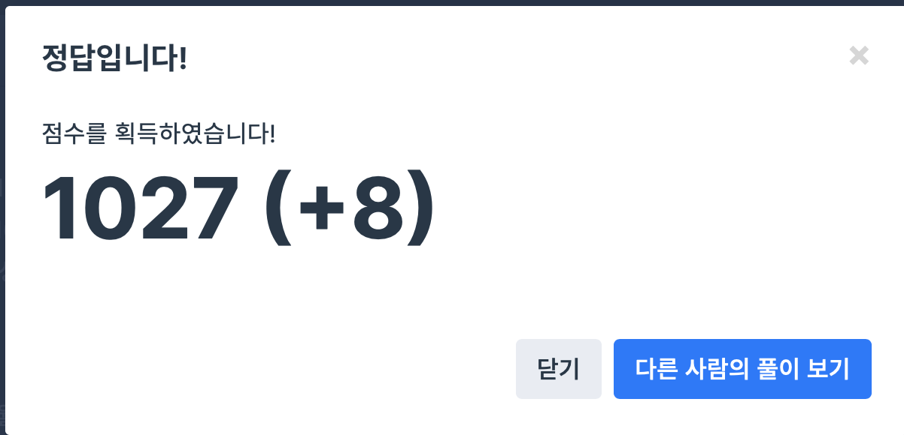

## 문제
- 프로그래머스 : 2016년
- https://programmers.co.kr/learn/courses/30/lessons/12901

<br/>

## 풀이
- 월 일에 해당하는 총 일 수를 구한 후, 7로 나눈 나머지 값에 따라 요일을 구했다.

<br/>

## 코드 

```c++
#include <string>
#include <vector>

using namespace std;

string solution(int a, int b) {
    string answer = "";
    
    int day = 0;
    
    if (a>=2){ day += 31;}
    if (a>=3) { day += 29; }
    if (a>=4) { day += 31; }
    if (a>=5) { day += 30; }
    if (a>=6) { day += 31; }
    if (a>=7) { day += 30; }
    if (a>=8) { day += 31; }
    if (a>=9) { day += 31; }
    if (a>=10) { day += 30; }
    if (a>=11) { day += 31; }
    if (a>=12) { day += 30; }
    
    day += b;
    int week = day % 7;
    
    switch(week){
        case 0:
            answer = "THU";
            break;
        case 1 :
            answer = "FRI";
            break;
        case 2:
            answer = "SAT";
            break;
        case 3:
            answer = "SUN";
            break;
        case 4 :
            answer = "MON";
            break;
        case 5 :
            answer = "TUE";
            break;
        case 6 :
            answer = "WED";
            break;
    }
    
    return answer;
}
```


<br/>


## screenshot


