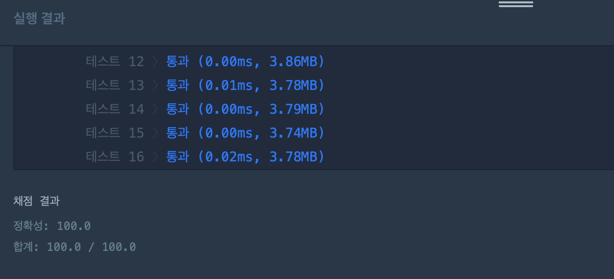

## 문제
- 프로그래머스 : 가운데 글자 가져오기
- https://programmers.co.kr/learn/courses/30/lessons/12903

## 풀이
- 입력한 문자의 길이가 홀수일 경우, 짝수일 경우 나누어서 풀었다. 비교적 간단한 문제!

## 코드
```c++
#include <string>
#include <vector>

using namespace std;

string solution(string s) {
    string answer = "";
    int len = s.length();
    
    if(len%2 == 0){
        string ans1(1, s.at(len/2-1));
        string ans2(1, s.at(len/2));
        
        answer = ans1 + ans2;
    } else {
        answer = s.at(len/2);
    }
    return answer;
}
```

## screenshot


## 반성
string 관련 함수에 대해 다시 정리할 필요가 있다 ..

```c++
s.length(); // string 길이 반환

s.at(idx); // string 의 특정 문자 반환. 리턴 타입이 char (이거 때문에 약간 삽질을 했다..)

string char2str(1, character); // char -> stirng 형변환

```


## 참고자료
- 없음
