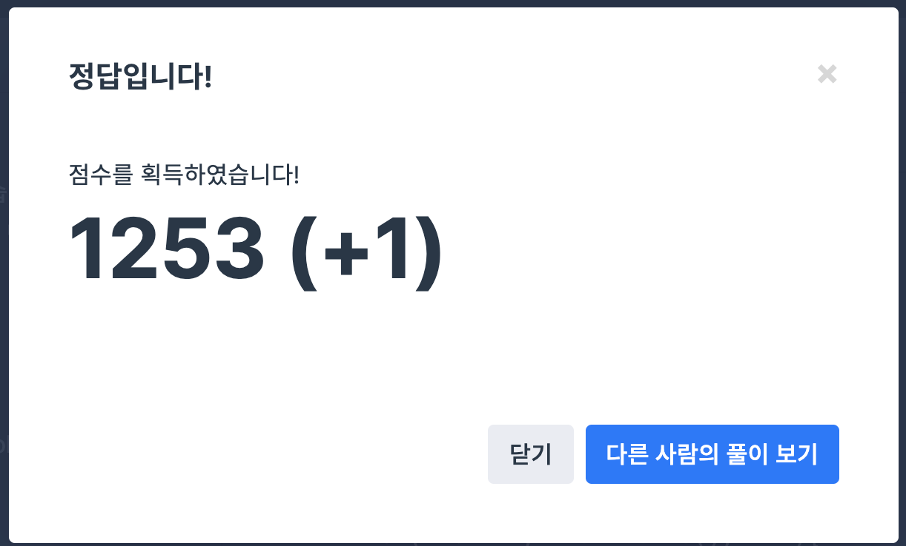

## 문제
- 프로그래머스 : 같은 숫자는 싫어
- https://programmers.co.kr/learn/courses/30/lessons/12906

<br/>

## 풀이
- 중복 숫자는 없는 ans배열의 가장 마지막 원소와 비교하며 적절히 원소를 push했다.

<br/> 

## 풀이

```c++
#include <vector>

using namespace std;

vector<int> solution(vector<int> arr) 
{
    vector<int> ans;
    int ans_size=0;
    ans.push_back(arr[0]);
    
    for(int i=1; i<arr.size(); i++){
        if(arr[i] != ans[ans_size]){
            ans_size++;
            ans.push_back(arr[i]);
        } 
    }
    
    return ans;
}
```

<br/>

## screenshot

  
