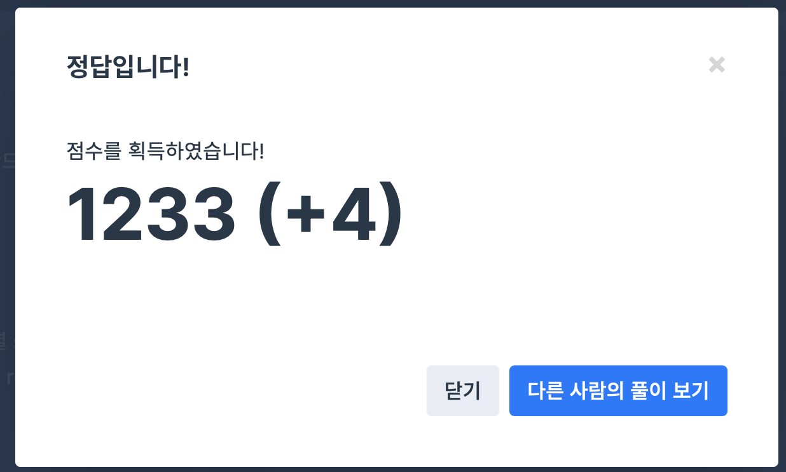

## 문제
- 프로그래머스 : 올바른 괄호
- https://programmers.co.kr/learn/courses/30/lessons/12909

<br/>

## 풀이
- LIFO(Last In First Out) 구조를 따르는 **스택** 을 사용해서 푸는 문제.
- 문자열 하나씩 순회해서 여는 괄호 ``` ( ``` 일 경우에는 스택에 push,   
닫는 괄호 ``` ) ``` 일 경우에는 스택에서 pop 한다. 이 때 스택이 비어있는 경우 false 를 반환한다.
- 마지막으로 최종 스택의 크기가 0보다 클 경우 (여는 괄호가 남아있을 경우) false 를 반환, 나머지 경우 true 를 반환한다.

<br/> 

## 풀이

```c++
#include<string>
#include <iostream>
#include <stack>

using namespace std;

bool solution(string s)
{
    stack<int> stk;

    for(int i=0; i<s.length(); i++){
        if(s.at(i) == '('){
            stk.push(1);
        } else {
            if(stk.empty()){
               return false; 
            } else {
                stk.pop();
            }
        }
    }
    
    if(stk.empty()){
        return true;
    }

    return false;
}
```

<br/>

근데 풀다가 문득 생각난건데 굳이 stack 을 써야 할 이유가 없다.. 숫자만 세도 충분하다.

```c++
#include<string>
#include <iostream>

using namespace std;

bool solution(string s)
{
    int cnt = 0;
    for(int i=0; i<s.size(); i++){
        if( s.at(i)=='(' ){
            cnt++;
        } else {
            if(cnt<=0){
                return false;
            } else {
                cnt--;
            }
        }
    }

    if (cnt==0){
        return true;
    } else{
        return false;
    }
}
```

stack 라이브러리를 불러오지 않아도 문제는 잘 풀린다❗️

<br/>

## screenshot

  
