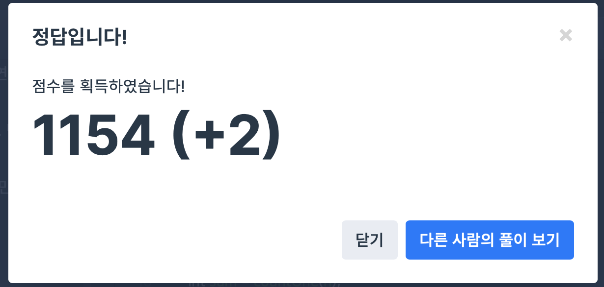

## 문제
- 프로그래머스 : 다음 큰 숫자
- https://programmers.co.kr/learn/courses/30/lessons/12911

<br/>

## 풀이
- ``` countOne ``` 함수를 통해 자연수 n을 2진수로 변환했을 때 1의 갯수를 구한다.
- n에 1씩 더해가며 값을 비교한다.


<br/>


## 코드

```c++
using namespace std;

int countOne(int n){
    int cnt = 0;
    while(n>0){
        if(n%2 == 1){
            cnt++;
        }
        n/=2;
    }
    return cnt;
}


int solution(int n) {
    int sum = countOne(n);
    int newsum;
    while(true){
        n++;
        newsum = countOne(n);
        if(sum == newsum){
            return n;
        }
    }
}
```


<br/>

## screenshot




<br/>
