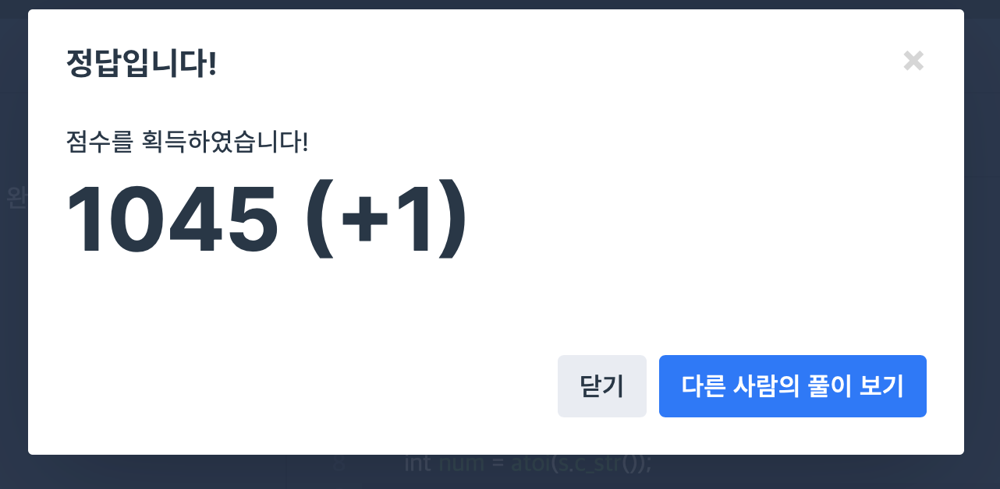

## 문제
- 프로그래머스 : 문자열을 정수로
- https://programmers.co.kr/learn/courses/30/lessons/12925

<br/>

## 풀이
- int -> string, string-> int 만 안다면 1분만에 풀 수 있는 문제

```c++

// int -> string : atoi()
string str = "123;
int num = atoi(str.c_str());

// string -> int : to_string()
int num = 123;
string str = to_string(num);

```

<br/>


## 코드

```c++
#include <string>

using namespace std;

int solution(string s) {
    int answer = 0;
    
    int num = atoi(s.c_str());
    answer += num;
    
    return answer;
}
```


<br/>


## screenshot




<br/>

