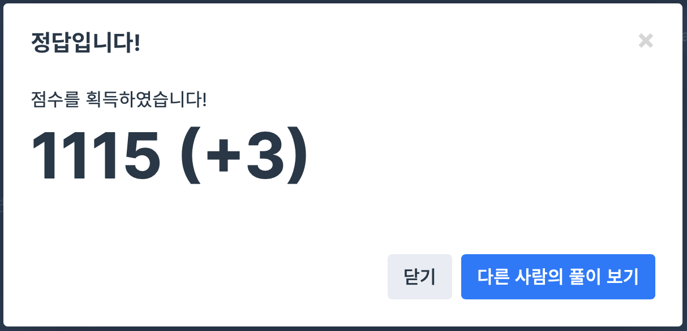

## 문제
- 프로그래머스 : 최댓값과 최솟값
- https://programmers.co.kr/learn/courses/30/lessons/12939

<br/>

## 풀이
- stringstream 의 첫 사용..! token 으로 잘라서 int 로 변환한 후 vector 에 push 했다.
- 이후 값을 비교해가며 minVal, maxVal 값을 update 해주었다.


<br/>


## 코드

```c++
#include <string>
#include <sstream>
#include <vector>

using namespace std;

string solution(string s) {
    string answer = "";
    string token = "";
    vector<int> v;
    int minVal, maxVal;
    
    for(stringstream sts(s); (sts >> token); ){
        v.push_back(stoi(token));
    }
    
    minVal = v[0];
    maxVal = v[0];
    
    for(int i=1; i<v.size(); i++){
        minVal = min(minVal, v[i]);
        maxVal = max(maxVal, v[i]);
    }
    
    answer = to_string(minVal) + " " + to_string(maxVal);
   
    return answer;
}
```


<br/>

## screenshot




<br/>
