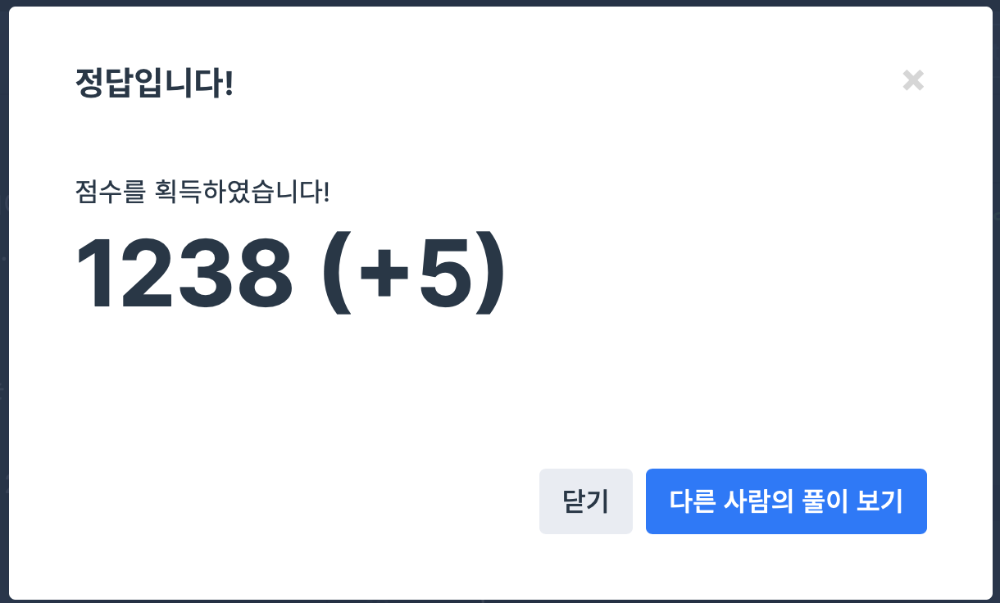

## 문제
- 프로그래머스 : 행렬의 곱셈
- https://programmers.co.kr/learn/courses/30/lessons/12949

<br/>

## 풀이
- 첫 번째 행렬의 행의 개수와 두 번째 행렬의 열의 개수가 같아야 곱셈이 가능하다.
- 곱셈으로 인해 생성되는 행렬의 크기는 첫 번째 행렬의 행, 두 번째 행렬의 열의 크기만 하다.
- 3중 for문을 기억해두자..!

<br/> 

## 코드

```c++
#include <vector>

using namespace std;

vector<vector<int>> solution(vector<vector<int>> arr1, vector<vector<int>> arr2) {
    vector<vector<int>> answer;
    
    for(int i=0; i<arr1.size(); i++){
        vector<int> v;
        for(int j=0; j<arr2[0].size(); j++){
            int sum = 0;
            for(int k=0; k<arr1[0].size(); k++){
                sum += arr1[i][k] * arr2[k][j];
            }
            v.push_back(sum);
        }
        answer.push_back(v);
    }
    
    return answer;
}
```

<br/>

## screenshot

  
