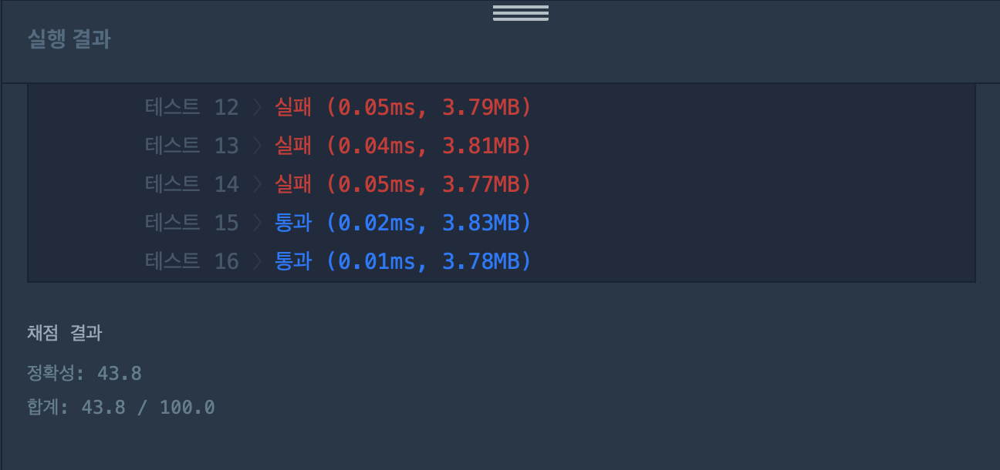
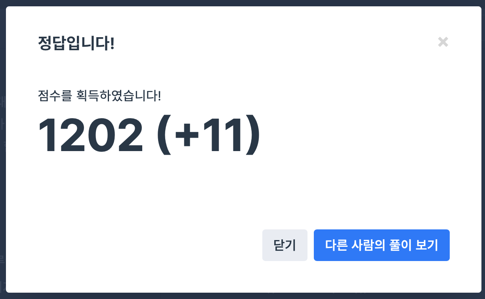

## 문제
- 프로그래머스 : JadenCase 문자열 만들기
- https://programmers.co.kr/learn/courses/30/lessons/12951


<br/>


## 풀이1
```c++
#include <string>
#include <sstream>
#include <vector>

using namespace std;

string solution(string s) {
   string answer = "";
    vector<string> v;
    istringstream iss(s);
    
    for(string token; iss >> token;){
        for(int i=0; i<token.size(); i++){
            char ch = token.at(i);
            if(i==0 && isalpha(ch) && islower(ch)){
                ch-=32;
            } else if (i!=0 && isalpha(ch) && isupper(ch)){
                ch+= 32;
            }
            token.at(i) = ch;
        }
        v.push_back(token);
    }
    
    for(int i=0; i<v.size(); i++){
        answer += v[i] + " ";
    }

    answer.erase(answer.length()-1, 1);
    return answer;
}
```

- 문자열을 ```istringstream``` 을 사용해 공백을 기준으로 split 해서 ```vector<string> v``` 에 push 했다.
- 첫 문자는 대문자로, 첫 문자가 아닌 경우는 소문자로 바꿔주었다.

<br/>



- 결과 실패 ,, 🤯 이유는 잘 모르겠으나 메모리를 너무 잡아먹는 것 같다...


<br/> 

## 풀이2

```c++
#include <string>

using namespace std;

string solution(string s) {
   s.at(0) = toupper(s.at(0));
    for(int i=1; i<s.size(); i++){
        if(s.at(i-1) == ' '){
            s.at(i) = toupper(s.at(i));
        } else {
            s.at(i) = tolower(s.at(i));
        }
    }
    return s;
}
```

<br/>

- 훨씬 간결해진 코드이다.
- 문자열을 split 하지 않고 전 문자가 공백인 경우(첫 문자인 경우) 에만  ```toupper()``` 으로 대문자로 변환하고, 공백이 아닌 경우 (첫 문자가 아닌 경우) 
```tolower()``` 으로 소문자로 변환한다.


 
 
 - 결과 성공 〰️‼️
 
 <br/>
 
 ## 반성
 
- 문자열 관련 내장 함수를 다시 정리하는 계기가 되었다. 제대로 정리해두자 ‼️
 
```c++
toupper(); // 대문자 변환
tolower(); // 소문자 변환

isalpha(); // 문자열인 경우 true, 아닐 경우 false 반환
```
 
 
