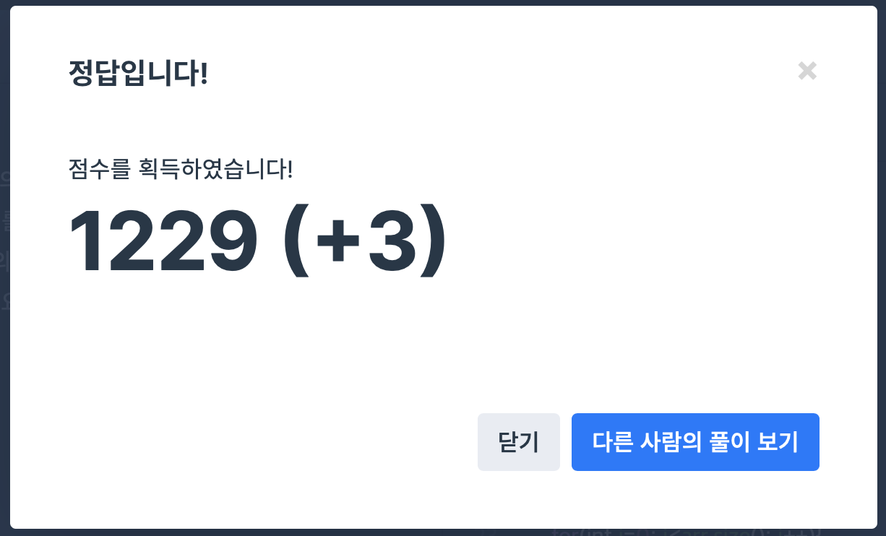

## 문제
- 프로그래머스 : N개의 최소공배수
- https://programmers.co.kr/learn/courses/30/lessons/12953

<br/>

## 풀이
- [유클리드 호제법](https://github.com/ChoiEunji0114/TIL/blob/master/algorithm/Euclidean_algorithm.md) 에 대한 정확한 이해가 필요하다.   
정확하게 이해하고 있으면 바로 풀리는 문제❗️

<br/> 

## 풀이

```c++
#include <iostream>
#include <vector>

using namespace std;

int gcd(int a, int b){
    int c;
    while(b!=0){
        c = a % b;
        a = b;
        b = c;
    }
    return a;
}

int lcs(int a, int b){
    return a * b / gcd(a, b);
}

int solution(vector<int> arr){
    
    int ans = 1;
    for(int i=0; i<arr.size(); i++){
        ans = lcs(ans, arr[i]);
    }
    
    return ans;
}

```

<br/>

## screenshot

  
