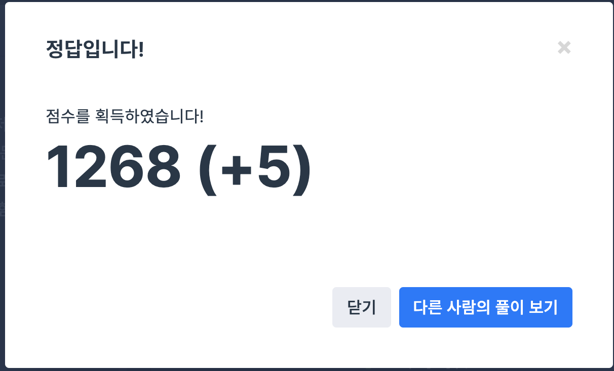

## 문제
- 프로그래머스 : 2017 팁스타운 - 짝지어 제거하기
- https://programmers.co.kr/learn/courses/30/lessons/12973

<br/>

## 풀이 1

```c++
#include <string>
#include <iostream>

using namespace std;

int solution(string s)
{   
    while(s!=""){
        string newStr = "";
        bool isDel = false;
        
        for(int i=1; i<s.size(); i++){
            if(s[i-1]==s[i]){
                isDel = true;
                s[i-1] = ' ';
                s[i] = ' ';
                break;
            }
        }
        
        if(isDel){
            for(int i=0; i<s.size(); i++){
                if(s[i] != ' ')
                    newStr += s[i];
            }
            s = newStr;

        } else {
            break;
        }
        
    }
    
    if(s=="") return 1;
    else return 0;
    
}
```


시간 초과 에러..!! 이런 경우는 처음부터 다시 풀어야 하기에 당황했다,,    

문자열 중복을 체크해가며 하나하나 제거해  newStr에 다시 저장하는 무한 루프를 도는 것이 문제이다 ㅠㅠ       
너무 깊게 생각한 것 같다. 하지만 난 이런 생각밖에 안 나는걸,,

<br/>

## 풀이 2

```c++
#include <string>
#include <stack>

using namespace std;

int solution(string s)
{   
    stack<char> stk;
    
    for(int i=0; i<s.size(); i++){
        if(stk.empty()){
            stk.push(s[i]);
        } else {
            if(stk.top()==s[i]) {
                stk.pop();
            } else {
                stk.push(s[i]);
            }
        }
    }
    
    if(stk.empty()) return 1;
    else return 0;
}
```

문자열 제거를 사용하기 보다는 `stack` 을 사용해 for문을 한 번만 돌도록 구현했다.     
아까 코드보다 훨씬 간결해 짐을 확인할 수 있다. 



드디어 성공..!! 
