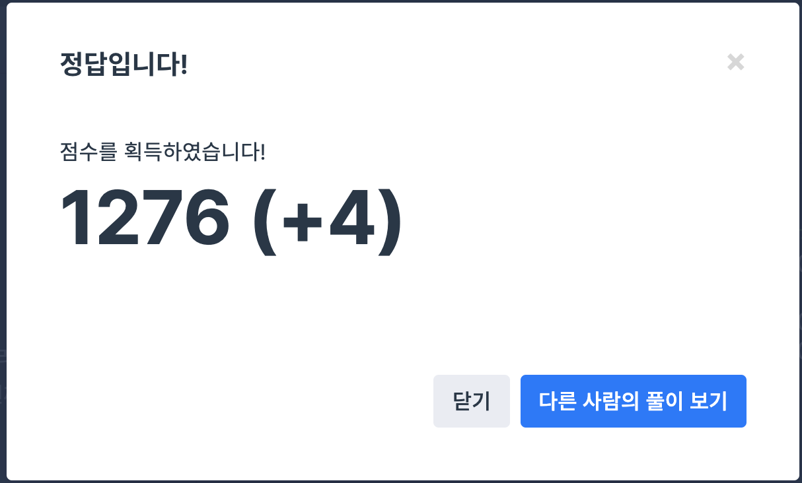

## 문제
- 프로그래머스 Summer/Winter Coding(~2018) : 영어 끝말잇기
- https://programmers.co.kr/learn/courses/30/lessons/12981

<br/>

## 풀이
- 앞글자 - 뒷글자 업데이트를 제대로 해주어야 한다.
- 중복 확인은 for문을 돌며 확인했다. 이 때 ans에 넣어야 할 숫자 처리를 잘 해야한다. (나머지가 0일 때와 아닐 때를 구분해서 push 해야 한다.)

<br/>

## 코드

```c++
#include <string>
#include <vector>
#include <iostream>

using namespace std;

vector<int> solution(int n, vector<string> words) {
    vector<int> answer;
    
    char frontChar; // 앞글자
    char endChar = words[0][words[0].length()-1]; // 뒷글자
    
    for(int i=1; i<words.size(); i++){
        frontChar = words[i][0]; // 앞글자 update
        if(endChar!=frontChar){ // 앞글자-뒷글자 일치하지 않는 경우 처리
            if((i+1)%n==0) {
                answer.push_back(n);
                answer.push_back((i+1)/n);
            } else {
                answer.push_back((i+1)%n);
                answer.push_back((i+1)/n+1);
            }
            return answer;
        } else {
            endChar = words[i][words[i].length()-1]; // 뒷글자 update
            string tmpword = words[i];
            for(int j=0; j<i; j++){
                if(tmpword==words[j]){
                    if((i+1)%n==0) {
                        answer.push_back(n);
                        answer.push_back((i+1)/n);
                    } else {
                        answer.push_back((i+1)%n);
                        answer.push_back((i+1)/n+1);
                    }
                    return answer;
                }
            }
        }
    }
    
    if(answer.size()==0){
        answer.push_back(0);
        answer.push_back(0);
    }
    return answer;
}
```

<br/>

## screenshot



