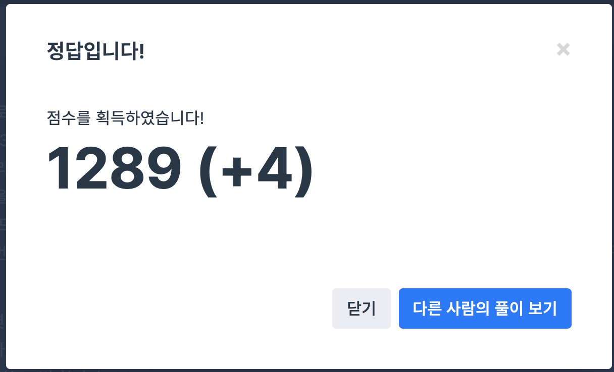

## 문제
- 프로그래머스 2017 팁스타운 : 예상 대진표
- https://programmers.co.kr/learn/courses/30/lessons/12985

<br/>

## 풀이
- 처음엔 어떻게 풀어야 할지 너무 막막했는데 예상보다 쉽게 풀린 문제다.
- a와 b가 만날 조건을 이해해야 한다. 둘의 위치 차이가 1이고, 작은 쪽이 홀수이면 대진 조건이 충족된다.

<br/>

## 코드

```c++
#include <iostream>

using namespace std;

int min(int a, int b){
    return a < b ? a : b;
}

int abs(int num){
    if (num>0) return num;
    else return num*(-1);
}

int solution(int n, int a, int b) {
    int answer = 0;
    int aloc = a, bloc = b; // a, b 위치 
    
    while(true){
        if(min(aloc, bloc)%2==1 && abs(aloc-bloc)==1) break;
        
        answer++;
        if(aloc%2==0) aloc/=2;
        else aloc = (aloc+1)/2;
        if(bloc%2==0) bloc/=2;
        else bloc = (bloc+1)/2;
    }

    return (answer+1);
}
```

<br/>

## screenshot

<p align="center"></p>

