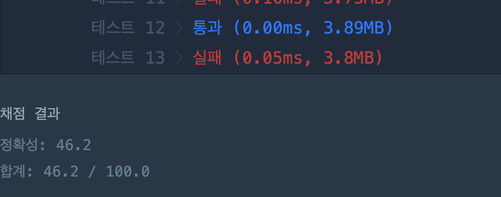
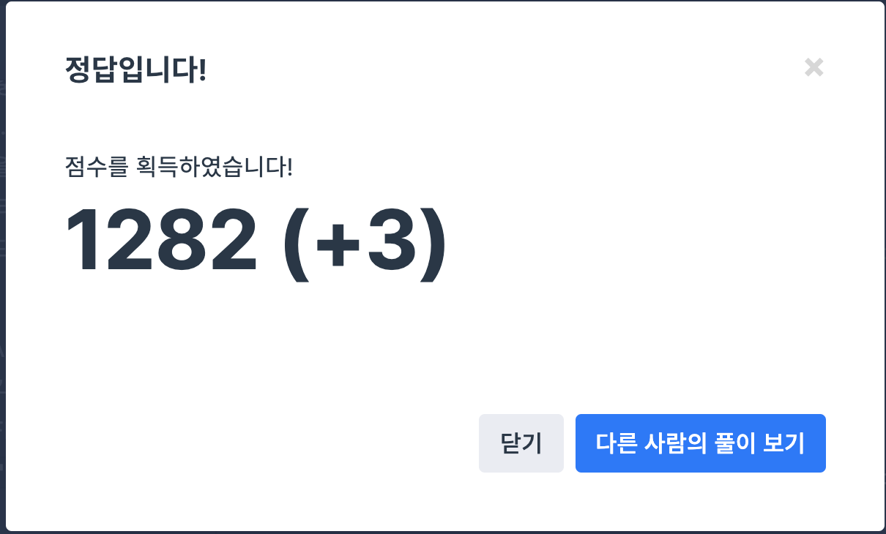

## 문제
- 프로그래머스 2018 kakao blind recruiment : 뉴스 클러스터링
- https://programmers.co.kr/learn/courses/30/lessons/17677

<br/>

## 풀이 1

```c++
#include <iostream>
#include <string>
#include <vector>

using namespace std;

vector<string> str2vec(string str){
    vector<string> vec;
    string tmpstr;
    for(int i=1; i<str.length(); i++){
        if(isalpha(str[i-1]) != 0 && isalpha(str[i]) != 0){
            tmpstr = "";
            char tmp1 = toupper(str[i-1]);
            char tmp2 = toupper(str[i]);
            tmpstr += tmp1; tmpstr+= tmp2;
            vec.push_back(tmpstr);
        }
    }
    return vec;
}

int countVec(vector <string> vec){
    int cnt = vec.size();
    for(int i=0; i<vec.size(); i++){
        if(vec[i]=="") cnt--;
    }
    return cnt;
}

int solution(string str1, string str2) {
    double ans = 1;

    vector<string> vec1 = str2vec(str1);
    vector<string> vec2 = str2vec(str2);
    
    int same = 0; int total = 0;
    
    for(int i=0; i<vec1.size(); i++){
        for(int j=0; j<vec2.size(); j++){
            if(vec1[i] == vec2[j]){
                same++;
                vec1[i] = ""; vec2[j] = "";
            }
        }
    }
    
    int cnt1 = countVec(vec1); int cnt2 = countVec(vec2);
    total = cnt1 + cnt2 + same;
    
    if(same!=0){
        ans = double(same)/double(total);
    } 
    
    return ans*65536;
}
```
<p align="center"></p>

- 나름 열심히 풀었지만 에러 와장창 났던 코드..^^ ㅠㅠ
- 문자열을 벡터에 제대로 옮겨담는 데에는 성공했지만 중복 교집합 처리에서 에러가 난 것 같다.
  
    > 교집합 처리는 중복 원소에 빈 문자열을 할당해 나중에 다시 count 하는 방식을 취했다. 하지만 사실 아직 이 방법에 어떤 문제가 있는 것인지는 정확히 이해가 가지는 않는다.

<br/>

## 풀이2

```c++
#include <string>
#include <vector>
#include <algorithm>
#include <ctype.h>

using namespace std;

vector<string> str2vec(string str){
    vector<string> vec;
    string tmpstr;
    for(int i=1; i<str.length(); i++){
        if(isalpha(str[i-1]) != 0 && isalpha(str[i]) != 0){
            tmpstr = "";
            char tmp1 = toupper(str[i-1]);
            char tmp2 = toupper(str[i]);
            tmpstr += tmp1; tmpstr+= tmp2;
            vec.push_back(tmpstr);
        }
    }
    return vec;
}

int solution(string str1, string str2) {
    int answer = 0;
    vector <string> sv1 = str2vec(str1);
    vector <string> sv2 = str2vec(str2);
    vector <string> sv = sv2;

    if(!sv1.size() && !sv2.size()) return 65536;

    for(int i = 0; i < sv1.size(); i++){
        auto itr = find(sv.begin(), sv.end(), sv1[i]);
        if(itr != sv.end())
        {
            sv.erase(itr);
            answer++;
        }
    }
    return 65536.0 * ((double)answer/(double)(sv1.size()+sv2.size()-answer));
}
```
- 중복 교집합 처리할 때 iterator 를 사용해 한 번에 구현했다.
- 코드가 훨씬 깔끔해지고 직관적으로 변했다. 에러도 해결!

<p align="center"></p>

