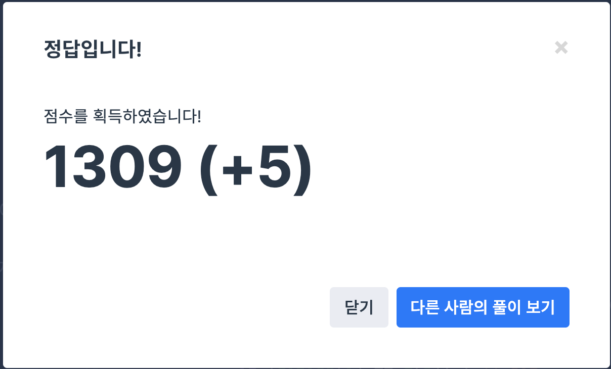

## 문제
- 프로그래머스 2018 kakao blind recruiment : 캐시
- https://programmers.co.kr/learn/courses/30/lessons/17680

<br/>

## 풀이

코드를 짜는 것 보다 문제 자체를 이해하는 데 더 오래 걸렸던 문제 .. **LRU 알고리즘** 에 대해 알아야 풀 수 있다.

1. FIFO : 페이지가 주기억장치에 적재된 시간을 기준으로 교체될 페이지를 선정하는 기법
    
    > 단점 : 중요한 페이지가 오래 있었다는 이유만으로 교체되는 불합리. 가장 오래 있었던 페이지는 앞으로 계속 사용될 가능성이 있음.

2. LFU : 가장 적은 횟수를 참조하는 페이지를 교체

    > 단점 : 참조될 가능성이 많음에도 불구하고 횟수에 의한 방법이므로 최근에 사용된 프로그램을 교체시킬 가능성이 있고, 해당 횟수를 증가시키므로 오버헤드 발생

3. LRU : 가장 오랫동안 참조되지 않은 페이지를 교체

    > 단점 : 프로세스가 주기억장치에 접근할 때마다 참조된 페이지에 대한 시간을 기록해야함. 큰 오버헤드가 발생

<br/>

## 코드

```c++
#include <string>
#include <vector>
#include <algorithm>
using namespace std;

int solution(int cacheSize, vector<string> cities) {
    if (cacheSize == 0)
        return cities.size() * 5;
    vector<string>q;
    int time = 0;
    for (int i = 0; i < cities.size(); i++) {
        int j = 0;
        transform(cities[i].begin(), cities[i].end(), cities[i].begin(), ::tolower); //도시 이름을 소문자로 변환
        for (j = 0; j < q.size(); j++) {
            if (cities[i] == q[j]) { // hit
                q.erase(q.begin() + j); // hit한 값을 가장 최근 사용으로 올려줌
                q.push_back(cities[i]);
                time += 1;
                break;
            }
        }
        if (j == q.size()) { // miss
            time += 5;
            if (q.size() >= cacheSize) 
                q.erase(q.begin()); // 캐시 사이즈를 넘을 경우 가장 예전에 사용한 값 삭제
            q.push_back(cities[i]);
        }
    }
    return time;
}
```

<br/>

## screenshot

<p align="center"></p>

