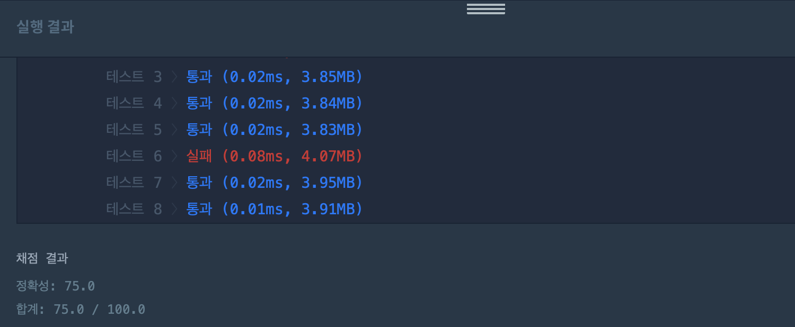
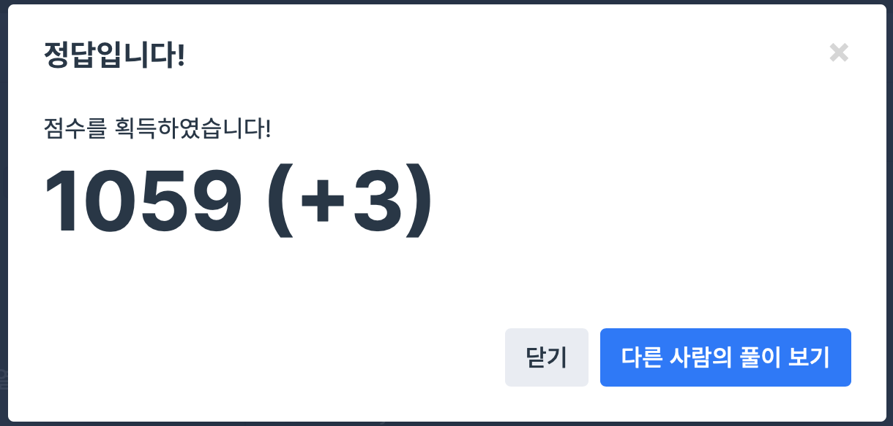

## 문제
- 프로그래머스 : 비밀지도
- 2018 kakao blind recruiment [1차]
- https://programmers.co.kr/learn/courses/30/lessons/17681


<br/>

## 코드1

```c++
#include <stdio.h>
#include <iostream>
#include <vector>
#include <string>

using namespace std;

string tenConvertTwo(int num, int n){
    int result = 0;
    int cnt=0;
    for(int i=1; num>0; i*=10){
        int binary = num%2;
        result += binary*i;
        num/=2;
        cnt++;
    }
    
    string str_result = to_string(result);
    string tmp = "";
    
    if(cnt < n){
        int diff = n-cnt;
        for(int i=0; i<diff; i++){
            tmp += "0";
        }
    }
    string new_result = tmp + str_result;
    return new_result;
}

vector<string> solution(int n, vector<int> arr1, vector<int> arr2){
    vector<string> answer;

    for(int i=0; i<n; i++){
        int num1 = arr1[i];
        int num2 = arr2[i];
        string new_str_num1 = tenConvertTwo(num1, n);
        string new_str_num2 = tenConvertTwo(num2, n);
        string tmpStr = "";
        for(int j=0; j<n; j++){
            int tmpNum1 = (int)new_str_num1.at(j)-48;
            int tmpNum2 = (int)new_str_num2.at(j)-48;
            
            if(tmpNum1==0 && tmpNum2==0){
                tmpStr += " ";
            } else {
                tmpStr += "#";
            }
        }
        answer.push_back(tmpStr);
    }
    

    return answer;
}
```



<br/>

- tenConvertTwo 메소드를 통해 2진수로 일일이 변환한 후 하나씩 비교해서 '#' 나 ' ' 를 append 했다.
- 역시나 메모리 오류 발생 .. ㅠㅠ 

<br/>
<br/>


## 코드2

```c++
#include <string>
#include <vector>
 
using namespace std;
 
vector<string> solution(int n, vector<int> arr1, vector<int> arr2) {
    vector<string> answer;
    vector<string> arr;
    
    for(int i = 0; i < n; i++){
        for(int j = 0; j < n; j++){
            if(arr1[i]%2 || arr2[i]%2){
                arr.push_back("#");
            }
            else{
                arr.push_back(" ");
            }
            arr1[i] = arr1[i]/2;
            arr2[i] = arr2[i]/2;
        }
        answer.push_back(arr[n-1]);
        for(int j = n-2; j >= 0; j--){
            answer[i] += arr[j];
        }
        arr.clear();
    }
    return answer;
}
```




<br/>

- 2진수로 변환한 수를 따로 저장하지 않고 바로 2로 나눈 나머지를 비교하면서 answer에 append 했다
- 성공!!!

<br/>
