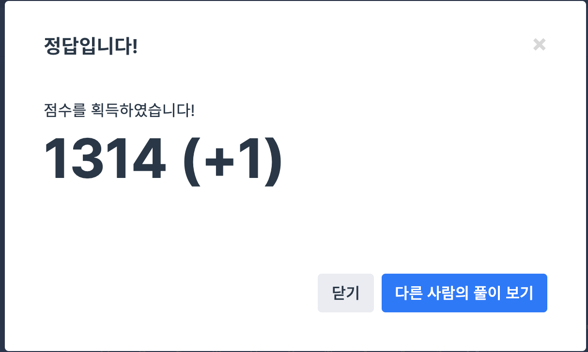

## 문제
- 프로그래머스 2018 kakao blind recruiment : 압축
- https://programmers.co.kr/learn/courses/30/lessons/17684

<br/>

## 풀이
- 문제를 완전히 잘 못 이해해 삽질한 문제. 사전 찾는 문자열이 길 수록 좋다길래 거꾸로 막 세고.. 암튼 삽질했다. 
- `find()` 함수를 사용해 데이터를 찾아냈다. 해당 번호는 `iterator-벡터 시작 값` 으로 구했다. 이것도 처음 알게 된 스킬이다. 풀면 풀 수록 나는 왜이렇게 모르는게 많은건지.. ㅠㅠ
- while 문을 돌아가며 적절히 `i++` `i--` 해주면 간단히 구현 가능하다.


<br/>

## 코드

```c++
#include <string>
#include <vector>
#include <algorithm>
#include <iostream>

using namespace std;

vector<int> solution(string msg) {
    vector<int> answer;
    vector<string> index = { "0","A","B","C","D","E","F","G","H","I","J","K","L","M","N","O","P",
"Q","R","S","T","U","V","W","X","Y","Z" };
    
    bool flag = true;
    vector<string>::iterator iter;
    int j;
    for(int i=0; i<msg.length(); i++){
        flag = true;
        string temp = "";
        while(flag){
            temp += msg[i];
            iter = find(index.begin(), index.end(), temp);
            if(iter != index.end()){ // 사전에 등록되어 있는 경우
                j = iter-index.begin(); // 색인번호 추출
                i++;
            } else {
                flag = false;
                answer.push_back(j);
                index.push_back(temp); // 사전 추가
                i--;
            }
        }
    }
    return answer;
}
```

<br/>

## screenshot

<p align="ceenter"></p>

