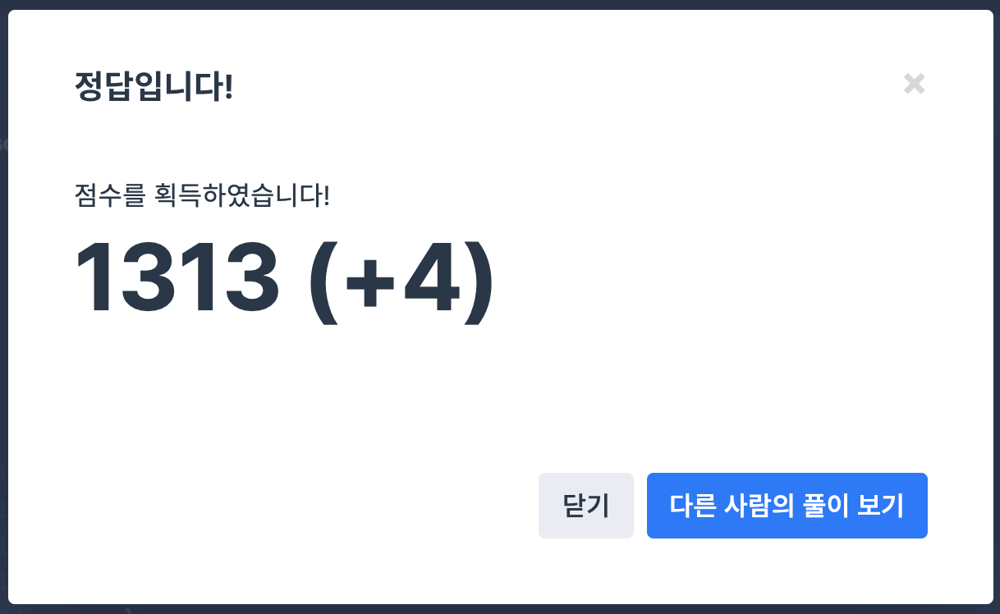

## 문제
- 프로그래머스 2018 kakao blind recruiment : 파일명 정렬
- https://programmers.co.kr/learn/courses/30/lessons/17686

<br/>

## 풀이
- 역시나 처음에 쉽네~ 하고 풀었다가 시간 왕창 쏟은 문제,,
- 문자열을 head, number, tail 로 분리까지는 했지만, 문제에서 원하는대로 정렬하는데에 애먹었다.
```c++
    vector<vector<string>> data(files.size(), vector<string>(3));
```
head, number, tail 문자열 3개를 모두갖는 벡터형의 벡터 배열 `data` 를 선언해야 한다.
그리고 벡터를 정렬해주는 정렬 함수를 만들어야 한다. (이 부분은 정말 공부를 해야겠다..)

- 여기서는 정렬함수 `sort` 를 쓰면 안된다. 이유는 해설..

    > C++기준으로 sort는 퀵정렬입니다. 퀵정렬은 같은 데이터를 비교할때 서로 바꿔주기 때문입니다. 문제는 같은 문자와 숫자일 경우에는 그대로 나둬야 하기 때문에 퀵정렬로 사용하면 에러가 납니다. 그렇기 때문에 다른 정렬인 병합정렬(stable_sort), 힙정렬(sort_heap)를 쓰셔야 안정한 정렬로 문제가 통과됩니다.

<br/>

## 코드

```c++
#include <string>
#include <vector>
#include <algorithm>

using namespace std;
bool Pred(vector<string> a, vector<string> b){
    string a1; string b1;
    // 대소문자 구분 X -> toupper
    for(int i=0; i<a[0].size(); i++){
        a1 += toupper(a[0][i]);
    }
    for(int i=0; i<b[0].size(); i++){
        b1 += toupper(b[0][i]);
    }
    if(a1.compare(b1)==0){ // head 가 같은 경우
        return stoi(a[1]) < stoi(b[1]); // number 비교
    } 
    if(a1.compare(b1)>0){
        return false;
    } else {
        return true;
    }
}

vector<string> solution(vector<string> files) {
    vector<string> answer;
    vector<vector<string>> data(files.size(), vector<string>(3));
    
    int temp = 0; // 0: head, 1:number, 2: tail
    int j = 0;
    for(int i=0; i<files.size(); i++){
        j = 0; temp = 0;
        while(j<files[i].size()){
            if(files[i][j]<'0' || files[i][j]>'9'){ // 숫자가 아닌 경우 -> head
                data[i][temp] += files[i][j];
            } else {
                temp++;
                break;
            }
            j++;
        }
        while(j<files[i].size()){
            if(files[i][j]>='0' && files[i][j]<='9'){ // 숫자인 경우 -> number
                data[i][temp] += files[i][j];
            } else {
                temp++;
                break;
            }
            j++;
        }
        while(j<files[i].size()){ // 나머지 -> tail
            data[i][temp] += files[i][j];
            j++;
        }
    }
    
    stable_sort(data.begin(), data.end(), Pred);
    for(int i=0; i<files.size(); i++){
        answer.push_back(data[i][0]+data[i][1]+data[i][2]);
    }
    return answer;
}
```

<br/>

## screenshot

<p align="ceenter"></p>

