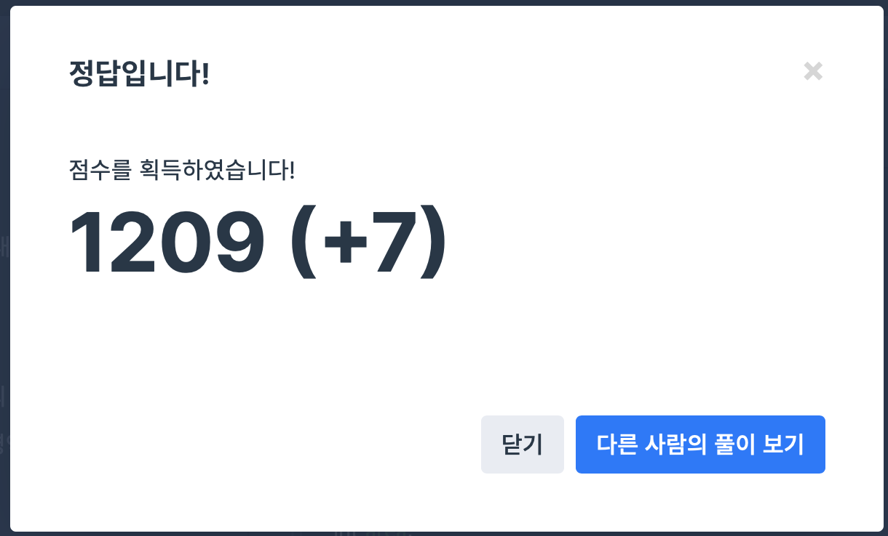

## 문제
- 프로그래머스 : 2017 카카오코드 예선 **카카오프렌즈 컬러링북** 
- https://programmers.co.kr/learn/courses/30/lessons/1829

<br/>

## 풀이
- 카카오코드 예선이라서 잔뜩 긴장하고 풀었지만 쉽게 푼 간단한 DFS 문제이다.
- 테스트 케이스에서 오류가 없지만 자꾸 제출하면 오류가 떴는데 전역에서 변수를 초기화했기 때문이었다 .. 🤯   
주의사항 **전역 변수를 정의할 경우 함수 내에 초기화 코드를 꼭 작성해주세요.** 잘 읽자..!


<br/> 

## 풀이

```c++
#include <iostream>
#include <vector>

using namespace std;

vector<vector<int>> picture;
bool visited[101][101];

int m,n;
int cnt, maxans;

const int dy[4] = {-1,1,0,0};
const int dx[4] = {0,0,-1,1};

int max(int a, int b){
    return a > b ? a : b;
}

int dfs(int y, int x){
    int count = 1;
    
    for(int i=0; i<4; i++){
        int ny = y + dy[i];
        int nx = x + dx[i];
        
        if(ny<0 || nx<0 || ny>=m || nx>=n) continue;
        if(visited[ny][nx]) continue;
        if(!visited[ny][nx] && picture[ny][nx] == picture[y][x]){
            visited[ny][nx] = true;
            count += dfs(ny,nx);
        }
    }
    
    return count;
}

vector<int> solution(int m2, int n2, vector<vector<int>> pic) {
    // 전역변수 초기화
    picture= pic;
    m = m2;
    n = n2;
    cnt = 0 , maxans = 0;
    for(int i=0; i<m; i++){
        for(int j=0; j<n; j++){
            visited[i][j] = false;
        }
    }
    
    for(int i=0; i<m; i++){
        for(int j=0; j<n; j++){
            if(!visited[i][j] && picture[i][j]>0){
                cnt++;
                visited[i][j] = true;
                int tmp = dfs(i,j);
                cout << tmp << endl;
                maxans = max(tmp, maxans);
            }
        }
    }
    
    vector<int> answer(2);
    answer[0] = cnt;
    answer[1] = maxans;
    return answer;
}
```

<br/>

## screenshot

  
