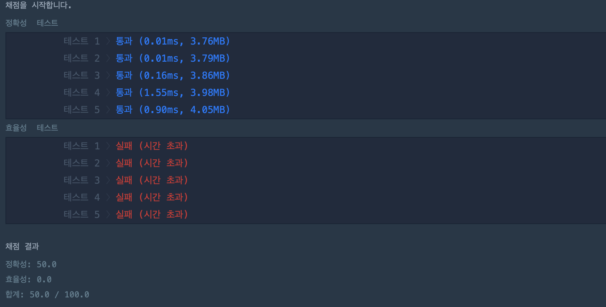

## 문제
- 프로그래머스 : 완주하지 못한 선수
- https://programmers.co.kr/learn/courses/30/lessons/42576

<br/>

## 풀이1
```c++
#include <string>
#include <vector>
#include <algorithm>

using namespace std;

string solution(vector<string> participant, vector<string> completion) {
    string answer = "";
    
    int length = participant.size();

    for(int i=0; i<length; i++){
        vector<string>::iterator iter;
        iter = find(completion.begin(), completion.end(), participant.at(i));

        if(iter == completion.end()){
            return participant.at(i);
        } else {
            vector<string>::iterator del = completion.begin();
            del += (i-1);
            completion.erase(iter);
            
        }
    }

    return answer;
}
```

- 완주하지 못한 선수를 검색할 때 마다 iter 함수로 탐색하는 것이 비효율적이다.
- vector.erase() 함수 역시 메모리를 많이 차지한다.
- 정확성은 만점이지만, 효율성은 0점이다 .. 


<br/>


## 풀이2
```c++
#include <string>
#include <vector>
#include <algorithm>

using namespace std;

string solution(vector<string> participant, vector<string> completion) {
    sort(participant.begin(), participant.end());
    sort(completion.begin(), completion.end());
    
    for(int i=0; i<completion.size(); i++){
        if(participant[i] != completion[i])
            return participant[i];
    }
    
    return participant[participant.size()-1];
}
```

- 벡터를 서로 비교하기 전, 정렬을 먼저 한다.
- 코드가 훨씬 간결해짐을 확인할 수 있다.
- 정확성, 효율성 모두 만점이다.

<br/>

## 반성
- vector 관련 함수에 대해 다시 정리해야 할 필요가 있다.
- 효율성이 낮은 함수는 사용을 자제하자.

<br/>

## 참고자료
- https://blockdmask.tistory.com/70
- https://velog.io/@sw7190/프로그래머스-완주하지-못한-선수-문제-풀이
