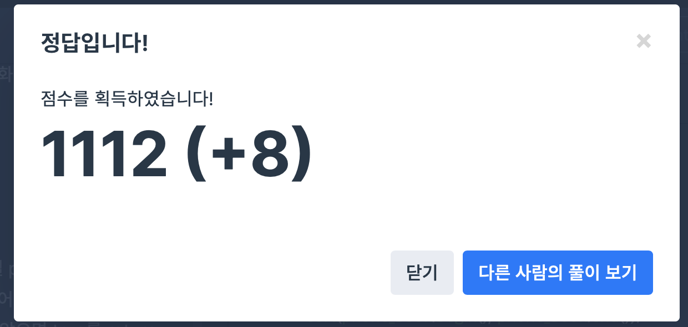

## 문제
- 프로그래머스 : 전화번호 목록
- Hash
- https://programmers.co.kr/learn/courses/30/lessons/42577

<br/>


## 풀이1 (실패)

```c++
#include <string>
#include <vector>

using namespace std;

bool solution(vector<string> phone_book) {
   for(int i=0; i<phone_book.size(); i++){ // phone_book[i]
        string phone = phone_book[i];
        
        for(int j=i+1; j<phone_book.size(); j++){ // phone_book[j]
            string cmp_phone = phone_book[j];
            
            if(cmp_phone.find(phone) != string::npos){
                return false;
            }
            
        }
    }
 
    return true;
}
```


- 에러 발생 ,,
- 좀 더 간결한 코드가 필요한 것 같다

<br/>
            


## 풀이2(성공)

```c++
#include <string>
#include <vector>
#include <algorithm>

using namespace std;

bool solution(vector<string> phone_book) {
   sort(phone_book.begin(), phone_book.end());
    
    for(int i=0; i<phone_book.size()-1; i++){
        if(phone_book[i] == phone_book[i+1].substr(0, phone_book[i].size())){
            return false;
        }
    }
    
    return true;
}
```




- 성공 ‼️
- ``` sort(phone_book.begin(), phone_book.end()); ``` 으로 먼저 정렬한 후, for문으로 비교를 시작한다.

   
<br/>   
