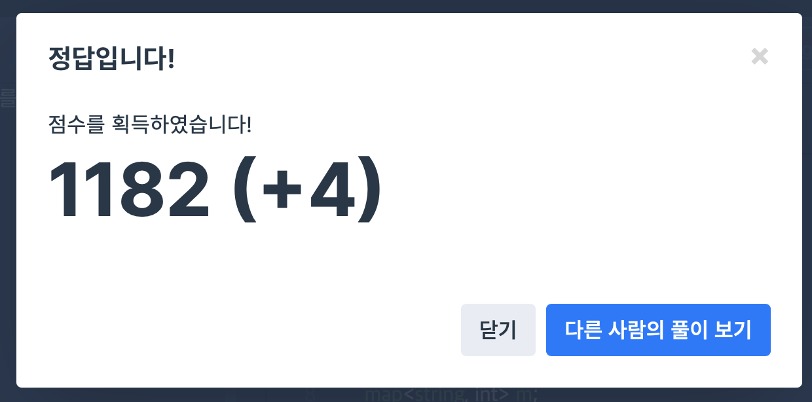

## 문제
- 프로그래머스 : 위장
- 해시
- https://programmers.co.kr/learn/courses/30/lessons/42578

<br/>

## 풀이
- Hash map 을 사용해야만 풀 수 있는 문제!!
- 위장 내용이 중요한 게 아니므로 위장 종류(key) 에 해당하는 value값은 갯수만 저장한다.
- 조합은 각 ```value + 1``` 값을 곱한 후 1을 뺀다 (위장 옷을 모두 안 입는 경우는 제외함)


<br/>


## 코드

```c++
#include <string>
#include <vector>
#include <map>

using namespace std;

int solution(vector<vector<string>> clothes) {
    map<string, int> m;
    for(vector<string> i : clothes){
        m[i[1]]++;
    }
    
    map<string , int>::iterator iter;
    int answer = 1;
    
    for(iter=m.begin(); iter!=m.end(); iter++){
        answer *= (iter->second+1);
    }
    return answer-1;
}
```


<br/>

## screenshot




<br/>
