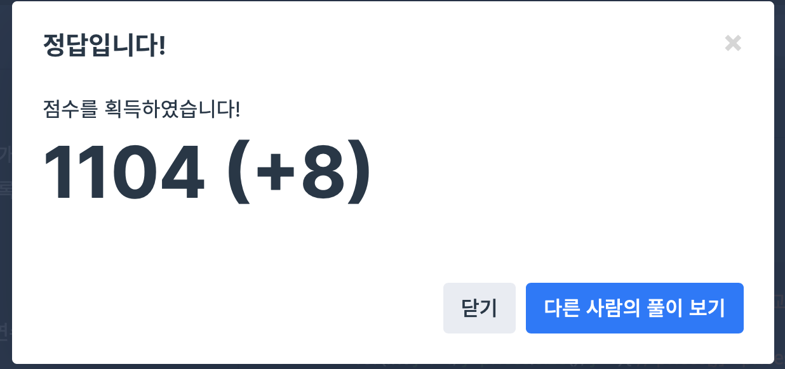

## 문제
- 프로그래머스 : 주식가격
- Stack / Queue
- https://programmers.co.kr/learn/courses/30/lessons/42584

<br/>

## 풀이
- 각 주식에 대해 주식 가격 리스트 ``` vector<int> prices ``` 를 순회한다.
- 가격이 떨어지지 않은 기간은 변수 cnt 에 저장한다.

<br/>

## 코드

```c++
#include <vector>

using namespace std;

vector<int> solution(vector<int> prices) {
    vector<int> answer;
    
    for(int i=0; i<prices.size(); i++){ // prices[i] : 현재 비교하는 주식 가격
        int cnt = 0; // 가격이 떨어지지 않은 기간
        
        for(int j=i+1; j<prices.size(); j++){ // prices[j] : prices[i] 와 비교할 주식 가격
            cnt++;
            if(prices[i] > prices[j]){ // 가격이 떨어진 경우
                break;
            }
        }
        answer.push_back(cnt);
    }
    
    return answer;
}
```


<br/>

## screenshot


   
<br/>   
