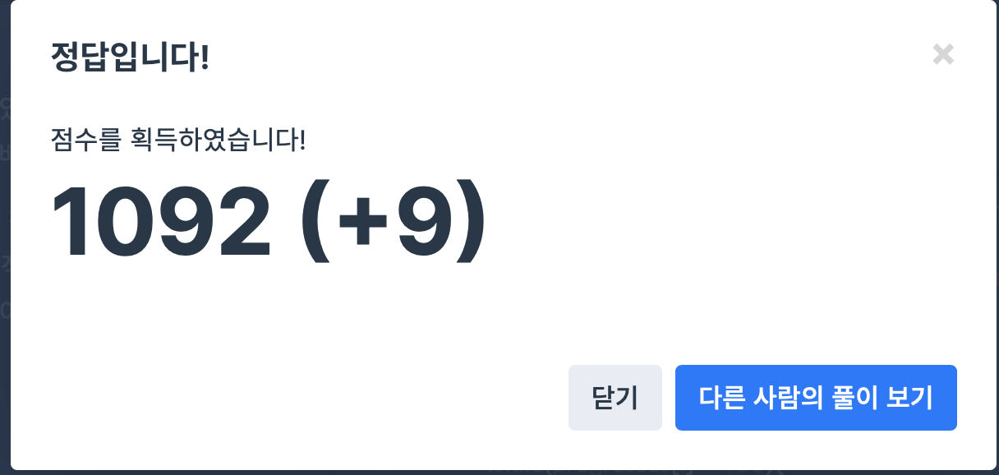

## 문제
- 프로그래머스 : 기능개발
- https://programmers.co.kr/learn/courses/30/lessons/42586

<br/>

## 풀이
- queue 를 사용해 푸는 문제
- 각 기능이 완료되기까지의 필요한 날짜 수를 계산해  ``` queue<int> days ``` 에 저장한다
- 날짜 수를 알맞게 비교해 queue에 pop 하고, 이 때마다 answer에 적절히 push_back 한다.


<br/>


## 코드

```c++
#include <string>
#include <vector>
#include <queue>

using namespace std;

vector<int> solution(vector<int> progresses, vector<int> speeds) {
    vector<int> answer;
    queue<int> days; // 기능의 진도가 100% 되는 날짜
    int day_count, day;
    
    for(int i=0; i<progresses.size(); i++){
        day_count = 0;
        while(progresses[i] < 100){
            progresses[i] += speeds[i]; // 진도 += 개발 속도
            day_count++;
        }
        days.push(day_count);
    }
    
    day_count = 1; // 완료 되는 기능 수
    day = days.front(); // 첫 기능이 100% 되는 날짜
    days.pop();
    
    while(!days.empty()){ // queue 가 모두 pop 될 때까지 반복
        if(days.front() <= day){ // 다음 기능이 전 기능보다 먼저 100% 되는 경우
            days.pop();
            day_count++;
        } else { // 다음 기능이 아직 완료되지 않았을 경우
            answer.push_back(day_count);
            day_count = 1; // day_count 초기화
            day = days.front(); // day update
            days.pop();
        }
    }
    answer.push_back(day_count);
    
    return answer;
}
```

<br/>


## screenshot


