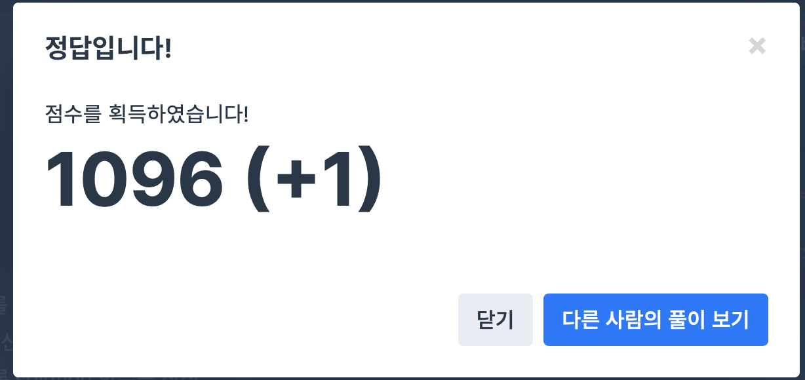

## 문제
- 프로그래머스 : 탑
- Stack / Queue
- https://programmers.co.kr/learn/courses/30/lessons/42588


<br/>


## 풀이
- Stack 을 사용해야 하는 줄 알았지만 Vector 만으로 충분히 풀 수 있는 문제
- 역 순으로 각 탑을 탐색한 후, ``` reverse(answer.begin(), answer.end()) ``` 으로 다시 역 재정렬 한다.


<br/>


## 코드

```c++
#include <algorithm>
#include <vector>

using namespace std;

vector<int> solution(vector<int> heights) {
    vector<int> answer;
    
     for(int i=heights.size()-1; i>=0; i--){ // i : 탑의 idx
        int cur_height = heights[i];
        int flag = 0; // flag=0 : 수신하는 탑이 없음, flag=1 : 수신하는 탑이 있음
        
        for(int j=i-1; j>=0; j--){ // j : 왼쪽부터 탐색할 탑의 idx
            if(cur_height < heights[j]){
                flag = 1;
                answer.push_back(j+1);
                break;
            }
        }

        if(flag==0){ // 수신하는 탑이 없는 경우 0을 push
            answer.push_back(0);
        }
    }
    
    reverse(answer.begin(), answer.end());
    
    return answer;
}
```


<br/>


## screenshot




<br/>
