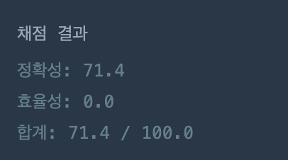
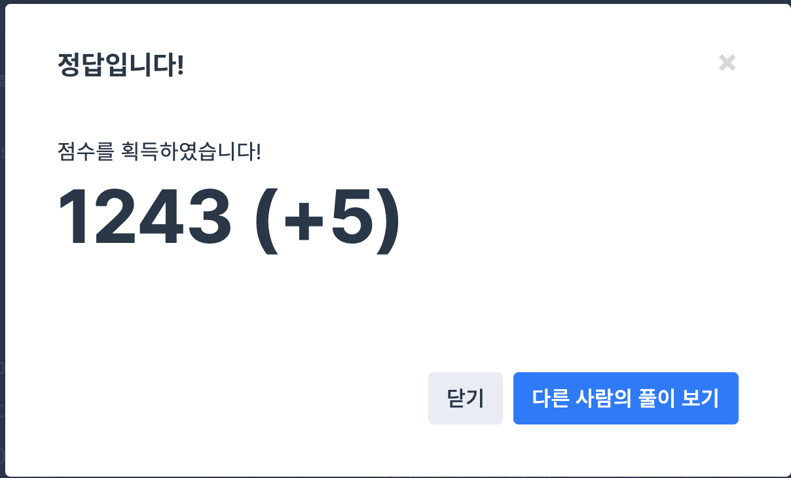

## 문제
- 프로그래머스 : 더 맵게
- https://programmers.co.kr/learn/courses/30/lessons/12949
- 힙(Heap)

<br/>

## 풀이 1


<br/> 

## 코드

```c++
#include <string>
#include <vector>
#include <algorithm>

using namespace std;

int solution(vector<int> scoville, int K) {
   int answer = 0;

    while(true){
        sort(scoville.begin(), scoville.end());
        if(scoville[0] >= K){
            break; // 종료
        }
        
        if(scoville.size()<2){
            break; // 종료
        }
        
        // 음식 섞기
        int newSco = scoville[0] + (scoville[1]*2);
        cout << "newSco : " << newSco << endl;
        answer++;
        
        scoville[0] = newSco;
        scoville[1] = newSco;
        scoville.erase(scoville.begin(), scoville.begin()+1);
    }
    
    if (scoville.size() < 2 ) return -1;
    else return answer;
}
```



- 처음에 while 문을 돌아가며 스코빌 지수를 섞고 `erase` 를 해주었으나 (해당 인덱스의 벡터 원소를 지움),   
인덱스도 제대로 지정하기 힘들었고, 무엇보다 시간 초과 문제가 발생했다.

<br/>

## 풀이 2

```c++
#include <vector>
#include <queue>

using namespace std;

int solution(vector<int> scoville, int K) {
    int answer = 0;
    int first, second;
    
    // 오름차순 우선순위 큐
    priority_queue<int, vector<int>, greater<int>> pq;
    for(int i=0; i<scoville.size(); i++){
        pq.push(scoville[i]);
    }
    
    while(pq.top()< K && pq.size()>1){
        answer++;
        first = pq.top();
        pq.pop();
        second = pq.top();
        pq.pop();
        pq.push(first+second*2);
    }
    
    if(pq.top()<K) return -1;
    else return answer;
}
```
  

- 해답은 **우선 순위 큐** 이다.
- 스코빌 지수가 가장 낮은 두 원소를 pop한 다음, 섞은 스코빌 지수의 음식을 다시 큐에 push한다. 
- 자동으로 오름차순 정렬까지 돼니 코드도 훨씬 간결해져 가독성이 좋아졌다. 👍

