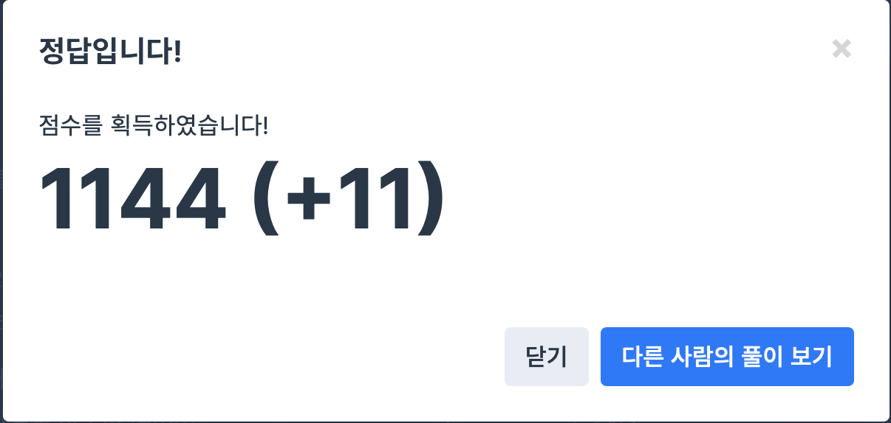

## 문제
- 프로그래머스 : 가장 큰 수
- 정렬
- https://programmers.co.kr/learn/courses/30/lessons/42746

<br/>

## 풀이
- int 를 string 으로 변환한 후 더할 때의 결과값이 큰 순 대로 정렬한 후 answer 에 append 한다.
- 정렬할 때 내가 custom 한 대로 정렬할 수 있다는 걸 이제서야 알게 되었다 ,, 기억해두자❗️
- answer 의 첫 값이 0일 때의 예외처리도 잊지 말고 처리할 것


<br/>


## 코드

```c++
#include <string>
#include <vector>
#include <algorithm>

using namespace std;

bool cmp(string &a, string &b){
    return a+b < b+a ? true : false;
}

string solution(vector<int> numbers) {
    string answer = "";
    
    vector<string> strnums;
    
    for(int i=0; i<numbers.size(); i++){
        strnums.push_back(to_string(numbers[i]));
    }
    
    sort(strnums.begin(), strnums.end(), cmp);
    
    while(!strnums.empty()){
        answer += strnums.back();
        strnums.pop_back();
    }
    
    if (answer[0] == '0')
        return "0";
    
    return answer;
}
```


<br/>

## screenshot




<br/>
