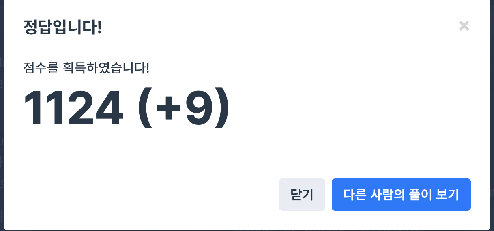

## 문제
- 프로그래머스 : H-Index
- https://programmers.co.kr/learn/courses/30/lessons/42747

<br/>

## 풀이
- H-Index 를 이해하는데 시간이 꽤 걸렸다 ,, 
- 먼저 내림차순으로 정렬한 이후 인용횟수가 많은 것부터 체크하여 차근차근 줄여간다.


<br/>


## 코드

```c++
#include <vector>
#include <algorithm>

using namespace std;

int solution(vector<int> citations) {
    int answer = 0;
    
   sort(citations.begin(), citations.end(), greater<int>()); // 내림차순 정렬
    
    for(int i=0; i<citations.size(); i++){
        if(citations[i] > i){
            answer++;
        } else {
            break;
        }
    }
 
    return answer;
}
```


<br/>

## screenshot




<br/>
