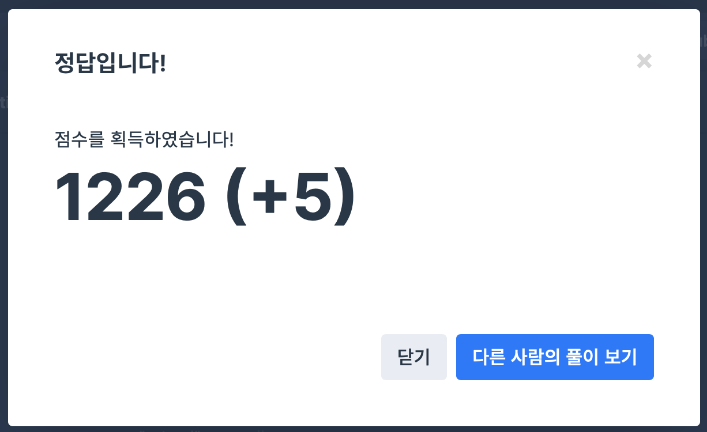

## 문제
- 프로그래머스 : 소수찾기
- https://programmers.co.kr/learn/courses/30/lessons/42839

<br/>

## 풀이
- 앞서 풀어본 [백준-소수구하기](https://github.com/ChoiEunji0114/Algorithm-study/blob/master/posts/boj-1929.md) 와 동일하게 
[에라토스테네스의 체](https://github.com/ChoiEunji0114/TIL/blob/master/algorithm/erathosthenes.md) 알고리즘을 사용해 풀어야 한다.
- 먼저 입력된 ``` numbers ``` 를 내림차순 정렬해 가장 큰 수를 만든 후 2부터 가장 큰 수 까지 차례대로 소수인지 아닌지 검사한다.
- 이 때 ``` checknumbers(int i, string numbers) ``` 메소드로 numbers 로 만들 수 있는 소수인지 검사한다.
- 간단해 보이지만 이해하는 데 정말 오랜 시간이 걸렸다 ,, ㅠㅠ 


<br/> 

## 풀이

```c++
#include <iostream>
#include <string>
#include <vector>
#include <algorithm>

using namespace std;

bool checknumber(int i, string numbers){ // i가 numbers로 만들 수 있는 소수인지 판별
    bool flag = false;
    vector<bool> visit(numbers.length());
    
    while(i != 0){
        flag = false;
        int tmp = i%10; // 일의 자리부터 탐색 시작
        for(int j=0; j<=numbers.length(); j++){
            if(tmp==numbers[j]-'0' && visit[j]==0){ // numbers의 숫자인지 판단 && 방문 판단
                flag = true;
                visit[j] = 1;
                break;
            }
        }
        if(flag==false){
            return false;
        }
        i /= 10;
    }
    return true;
}

int solution(string numbers) {
    int answer = 0;
    
    // 내림차순 정렬 -> numbers 의 큰 수 만듦 
    sort(numbers.begin(), numbers.end(), greater<int>()); 

    vector<bool> tmp(stoi(numbers)+1);
    
    for(int i=2; i<=stoi(numbers); i++){
        if(tmp[i] == false && checknumber(i, numbers)){
            cout << "prime!" << endl;
            answer++;
        }
        if(tmp[i] == false){ // i의 배수는 모두 소수가 아님을 표시
            for(int j=i; j<=stoi(numbers); j+=i){
                tmp[j] = true;
            }
        }
    }

    return answer;
}
```

<br/>

## screenshot

  
