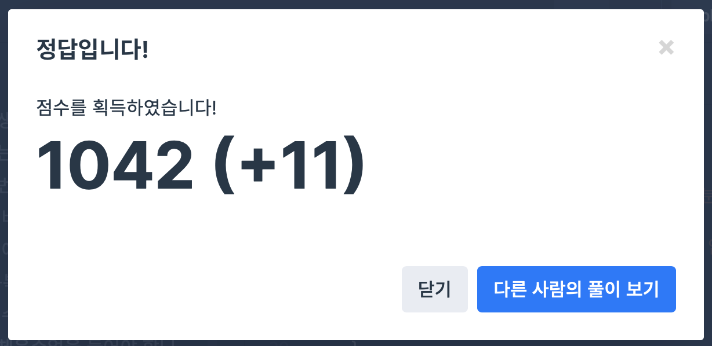

## 문제
- 프로그래머스 : 체육복
- https://programmers.co.kr/learn/courses/30/lessons/42862
- Greedy 

<br/>

## 풀이
- vector<int> student(n); 으로 처음에 학생을 할당하고 시작한다.
- 체육복을 잃어버린 학생, 여분이 있는 학생을 먼저 처리한다. (-1: 체육복 없음 , 0: 체육복 1개, 1: 체육복 여분 있음)
- 여분 체육복이 있는 학생을 기준으로 옆에 체육복이 없는 학생을 처리한다.

<br/>

## 코드

```c++

#include <vector>

using namespace std;

int solution(int n, vector<int> lost, vector<int> reserve) {
    int answer = 0;
     vector<int> student(n); // 학생 수 만큼 벡터 할당 (0으로 초기화)
    
    for(int i=0; i<lost.size(); i++){ // 체육복을 잃어버린 학생 처리
        student[lost[i]-1]--;
    }
    
    for(int i=0; i<reserve.size(); i++){ // 여분 체육복이 있는 학생 처리
        student[reserve[i]-1]++;
    }
    
    for(int i=0; i<student.size(); i++){
        if(student[i]==1 && i-1 > -1){ // 여분의 체육복이 있고, 맨 앞 학생이 아닌 경우
            if(student[i-1] == -1){ // 앞의 학생이 체육복이 없는 경우
                student[i-1]++;
                student[i]--;
            }
        }
        if(student[i]==1 && i+1 < student.size()){ // 여분의 체육복이 있고, 맨 뒤 학생이 아닌 경우
            if(student[i+1]==-1){ // 뒤의 학생이 체육복이 없는 경우
                student[i+1]++;
                student[i]--;
            }
        }
    }
    
    for(int i=0; i<student.size(); i++){
        if(student[i]==0 || student[i]==1)
            answer++;
    }
    return answer;
}

```

<br/>

## screenshot

