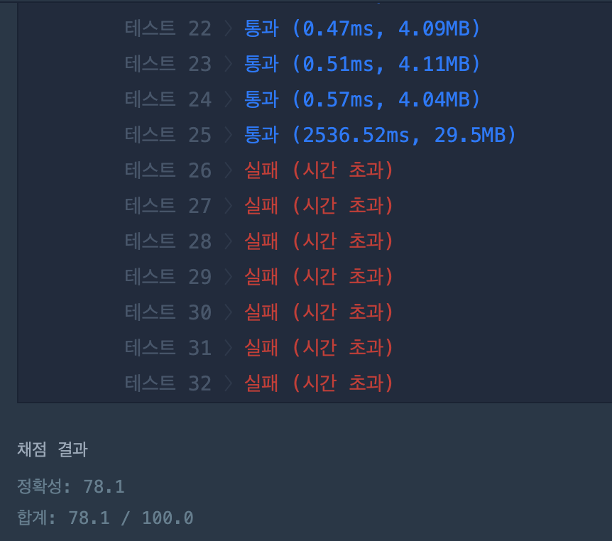
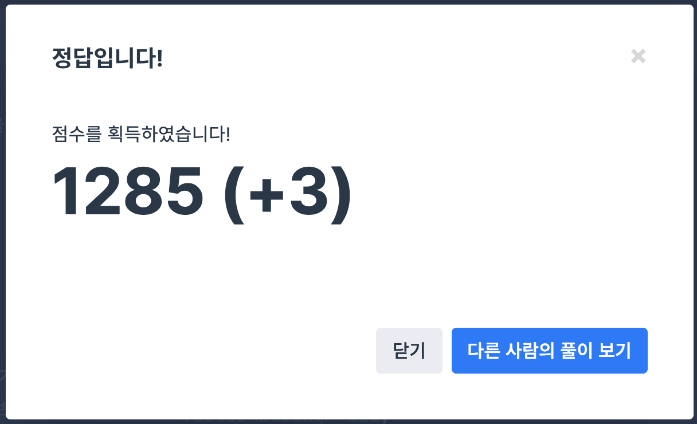

## 문제
- 프로그래머스 2019 kakao blind recruiment : 오픈채팅방
- https://programmers.co.kr/learn/courses/30/lessons/42888

<br/>

## 풀이 1
```c++
#include <string>
#include <vector>
#include <iostream>

using namespace std;

vector<string> solution(vector<string> record) {
    vector<string> answer;
    vector<pair<string, string>> id_name;
    
    string tmpidname, tmpid, tmpname;
    for(int i=0; i<record.size(); i++){
        if(record[i][0]=='L') continue; // 퇴장일 경우는 생략
        
        if(record[i][0]=='E') tmpidname = record[i].substr(6);
        if(record[i][0]=='C') tmpidname = record[i].substr(7);
        
        for(int j=0; j<tmpidname.length(); j++){
            if(tmpidname[j]==' '){
                tmpid = tmpidname.substr(0,j);
                tmpname = tmpidname.substr(j+1, tmpidname.length());
            }
        }
        bool isFindId = false; // 중복이 있는지 (닉네임 변경인지) 체크
        for(int j=0; j<id_name.size(); j++){
            if(tmpid==id_name[j].first){
                id_name[j].second = tmpname;
                isFindId = true;
            }
        }
        if(!isFindId) id_name.push_back(make_pair(tmpid, tmpname));
    }
    
    for(int i=0; i<record.size(); i++){
        if(record[i][0]=='C') continue; // 닉네임 변경인 경우는 생략
        
        string tmpid, tmpidname, name, msg;
        if(record[i][0]=='E'){ // 입장
            tmpidname = record[i].substr(6);
            for(int j=0; j<tmpidname.length(); j++){
                if(tmpidname[j]==' ') tmpid = tmpidname.substr(0,j);
            }
            for(int j=0; j<id_name.size(); j++){
                if(tmpid == id_name[j].first) name = id_name[j].second;
            }
            msg = name + "님이 들어왔습니다.";
        } else { // 퇴장
            tmpid = record[i].substr(6);
            for(int j=0; j<id_name.size(); j++){
                if(tmpid == id_name[j].first) name = id_name[j].second;
            }
            msg = name + "님이 나갔습니다.";
        }
        answer.push_back(msg);
    }
    
    return answer;
}
```

<br/>

<p align="center"></p>

> 테스트 케이스에서는 오류가 없었지만 시간 초과 에러가 났다.. (이런 경우 보통 다시 풀어야 한다.)


### 시간 초과가 났던 이유

1. 고유한 아이디와 닉네임을 저장하는 방식

   아이디와 닉네임만을 저장하는 `vector<pair<string, string>> id_name` 을 만들어 정보를 저장한 후, record 를 순회하며 유저 아이디에 상응하는 최종 닉네임을 찾아 ans 에 push 했다. 이 때 아이디 중복이 있는지 for문을 돌아 체크해야 했다. 매우 비효율적,,!

2. 메세지, 아이디, 닉네임 split

   공백을 기준으로 메세지, 아이디, 닉네임을 `substr` 하는 방식을 취했는데, 계속 for문을 돌아야 해서 상당히 비효율적인 코드인 걸 알지만.. 이 방법만 알아서 어쩔 수 없었다. ㅠㅠ 아마 여기에서 시간 초과 에러가 나지 않았나 싶다.

<br/>


## 풀이2

```swift
#include <string>
#include <sstream>
#include <map>
#include <vector>

using namespace std;

vector<string> solution(vector<string> record) {
    vector<string> answer;
    vector<string> uid;
    map<string, string> nickinfo; // Key: 아이디, info: 닉네임
    stringstream ss; string action; string id; string nickname;
    
    for(int i=0; i<record.size(); i++){
        ss.str(record[i]);
        ss >> action; // Enter, Leave, Change
        if(action=="Enter"){ // 입장
            ss >> id >> nickname;
            answer.push_back("님이 들어왔습니다.");
            uid.push_back(id);
            nickinfo[id] = nickname;
        } else if (action=="Leave"){ // 퇴장
            ss >> id;
            answer.push_back("님이 나갔습니다.");
            uid.push_back(id);
        } else { // 변경
            ss >> id >> nickname;
            nickinfo[id] = nickname;
        }
        ss.clear();
    }
    
    for(int i=0; i<answer.size(); i++){
        answer[i] = nickinfo[uid[i]] + answer[i]; // 아이디에 해당하는 닉네임
    }
    
    return answer;
}
```


<p align="center"></p>

> 시간 초과 에러 해결! 코드가 훨씬 간결하다.


### 해결 방법

1. map 사용

   <Key, value> 저장 방식이다. 자동으로 key 의 중복체크를 해준다.

2. stringstream 사용

   문자열을 자동으로 split 한다. 불 필요하게 for문을 계속 돌 필요가 없다.


C++ 에서의 사용하지 않는 스킬들이 정말 많았다. 편한 걸 쓰고싶은 고집을 계속 부려서인것 같다. map, stringstream 모두 알았지만 굳이 사용해보지 않았다. 앞으로는 다양한 기술을 사용해야 겠다 ㅠㅠ

