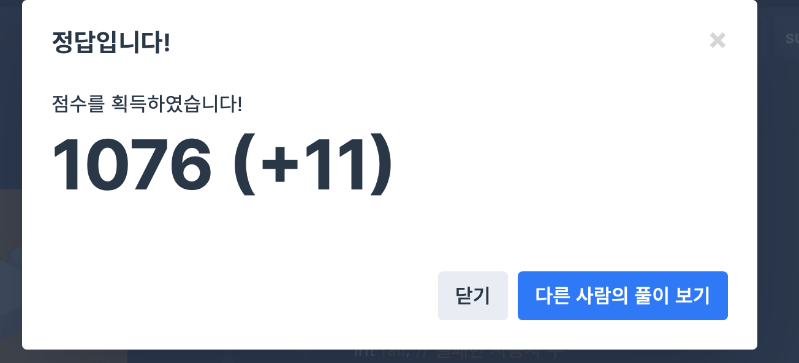

## 문제
- 프로그래머스 : 실패율
- 2019 kakao blind recruiment
- https://programmers.co.kr/learn/courses/30/lessons/42889

<br/>

## 풀이
- 문제를 제대로 이해하지 못한 채 무작정 코드를 짜서 삽질을 많이 했다 ,, 제대로 이해한 후 코드를 짤 것❗️
- 각 스테이지에 대해 도전한 사용자 수(challenge), 실패한 사용자 수(fail)을 저장했다.
- 각 스테이지에 도전한 사용자를 전체 사용자 수로 초기화한 후(stages.size()), 조건에 따라 수를 뺐다.

<br/>

## 코드

```c++
#include <iostream>
#include <vector>
#include <algorithm>

using namespace std;

vector<int> solution(int N, vector<int> stages){
    vector<int> answer;
    
    int challenge; // 도전한 사용자 수
    int fail; // 실패한 사용자 수
    float failure[2000];
    
    for(int i=1; i<=N; i++){ // i : 스테이지
        challenge = stages.size();
        fail = 0;
        for(int j=0; j<stages.size(); j++){ // stages[j] : 사용자가 현재 도전 중인 스테이지
            if(stages[j]<i){
                challenge--;
            }
            if(stages[j]==i){
                fail++;
            }
        }

        if(challenge ==0 || fail==0){
            failure[i] = 0.0;
        } else {
            failure[i] = (float)fail/(float)challenge;
        }
    }
    
        vector<pair<float, int>> v;
        // 실패율이 같은 스테이지가 있다면 작은 번호의 스테이지가 먼저 올 수 있도록 -1을 곱한다.
        for(int i=1; i<=N; i++){
            v.push_back({failure[i], i*-1});
        }
    
        sort(v.begin(), v.end());
    
        for(int i = v.size()-1; i>=0; i--){
            answer.push_back(-1*v[i].second);
            // cout << -1*v[i].second << endl;
        }
   
    return answer;
}
```


<br/>


## screenshot


<br/>
