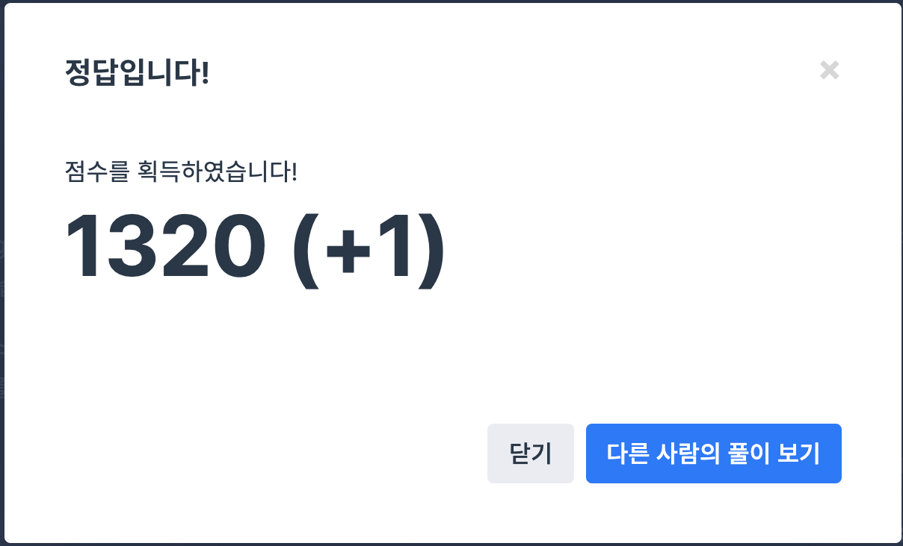

## 문제
- 프로그래머스 : 단어변환
- DFS / BFS
- https://programmers.co.kr/learn/courses/30/lessons/43163

<br/>

## 풀이
- 간단한 탐색 문제이다. `isChangable` 을 사용해 탐색 가능한 지 여부를 확인하고 DFS 탐색을 진행했다.
- `ans` 의 초기값이 100인 이유는 words의 최대 size가 50이므로 51이상 될 수 없기 때문이다.

<br/>

## 코드

```c++
#include <string>
#include <vector>

using namespace std;
int answer = 100;

bool isChangable(string str1, string str2){
    int diff = 0;
    for(int i=0; i<str1.length(); i++){
        if(str1[i] != str2[i]){
            diff++;
        }
    }
    if(diff==1) return true;
    else return false;
}

void dfs(string begin, string target, vector<string> words, vector<bool> &visited, int time){
    for(int i=0; i<words.size(); i++){
        if(isChangable(begin, words[i])){ // 변환 가능
            // 도착 여부 검사
            if(target==words[i]){
                if(time+1 < answer) {
                    answer = time+1;
                    return;
                }
            }
            
            // 방문 여부 검사
            if(visited[i]==false){
                visited[i] = true;
                dfs(words[i], target, words, visited, time+1);
            }
        }
   } 
}

int solution(string begin, string target, vector<string> words) {
    vector<bool> visited(words.size(), false);
    
    dfs(begin, target, words, visited, 0);
    
    if(answer==100) return 0;
    else return answer;
    
    return answer;
}
```
<br/>

## Screenshot

<p align="center"></p>

