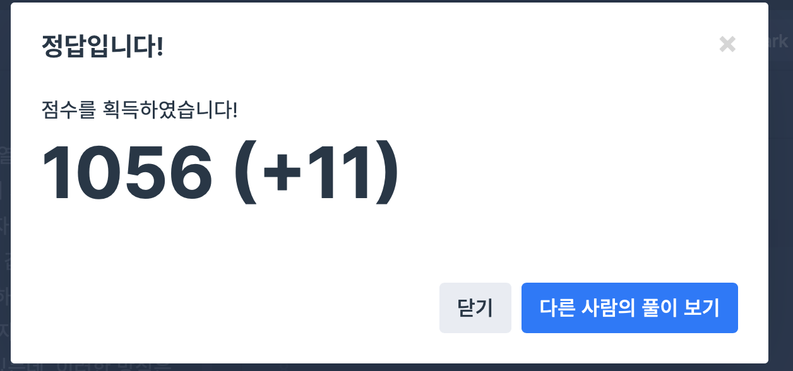

## 문제
- 프로그래머스 : 문자열 압축
- 2020 카카오 공채
- https://programmers.co.kr/learn/courses/30/lessons/60057

<br/>

## 코드
```c++
#include <string>

using namespace std;

int min(int a, int b){
    return a < b ? a : b;
}

int solution(string s) {
     if(s.size() == 1) return 1;
    
    int answer = 10001;
    int index = s.size()/2;
    
    // 길이 비교
    for(int x=index; x>0; x--){ // x : 문자열을 자르는 단위
        string print = ""; // 답 문자열
        string compare = ""; // 비교 문자열
        int count = 1;
        
        for(int i=0; i<s.size(); i+=x){
            string cur = s.substr(i,x); // 현재 비교하려는 문자열
            
            if(compare.empty()){ // 비교 문자열이 없는 경우
                compare = cur;
                continue;
            }
            
            if(compare != cur){ // 비교 문자열과 일치하지 않는 경우
                if(i+x >= s.size()){ // 비교 문자열이 범위를 넘어가는 경우
                    print += cur; // 답 문자열에 그대로 append
                }
                
                if(count>1){ // 비교 문자열이 전에 일치했던 경우
                    print += to_string(count) + compare;
                } else {
                    print += compare;
                }
                
                // 비교 문자열과 문자열 일치 수 초기화
                compare = cur;
                count = 1;
                
            } else { // 비교 문자열과 일치하는 경우 (compare == cur)
                count++; // 문자열 일치 수 증가
                
                if(i+x >= s.size()){ // 비교 문자열이 범위를 넘어가는 경우
                    print += to_string(count) + cur; // 답 문자열에 그대로 append
                }
            }
        }
        answer = min(answer, (int)print.size());
    }

    return answer;
}

```


<br/>

## screenshot

