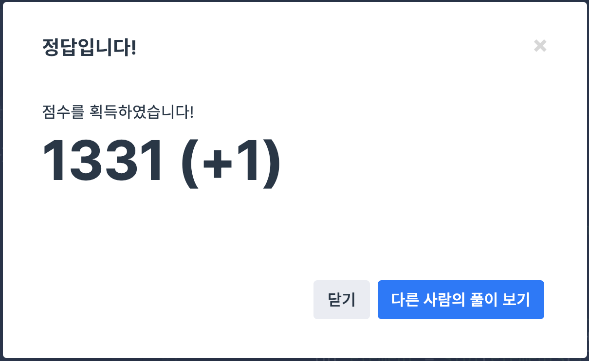

## 문제
- 2019 카카오 개발자 겨울 인턴십 : 튜플 
- https://programmers.co.kr/learn/courses/30/lessons/64065

<br/>


## 풀이1

```c++
#include <string>
#include <vector>
#include <algorithm>
#include <iostream>

using namespace std;

vector<int> solution(string s) {
    vector<int> answer;
    
    string tmpstr = "";
    for(int i=2; i<s.length()-2; i++){
        if(isdigit(s[i])){
            if(s[i-1]=='{' || s[i-1]==','){ // 새로운 숫자 시작 -> 초기화
                tmpstr = "";
            } 
            tmpstr+=s[i];
            if(s[i+1]==',' || s[i+1]=='}'){ // 숫자 종료
                int num = stoi(tmpstr);
                auto itr = find(answer.begin(), answer.end(), num);
                if(itr==answer.end()){
                    answer.push_back(num);
                }
                tmpstr = "";
            }
        }
    }
    
    return answer;
}
```

 **원소의 순서가 다르면 서로 다른 튜플이다** 에 주의해야 한다.  먼저 원소 정렬이 필요하다. (이런 경우 처음부터 문제를 다시 풀어야 한다 ㅠㅠ 문제를 꼼꼼히 읽자!)

<br/>

## 풀이2

```c++
#include <string>
#include <vector>
#include <algorithm>
#include <sstream>

using namespace std;

bool compare(string a, string b){
    return a.size()<b.size();
}

vector<string> split(string str, char delimiter) {
    vector<string> internal; string temp;
    stringstream ss(str);
    while (getline(ss, temp, delimiter)) {
        internal.push_back(temp);
    }
    return internal;
}

vector<int> solution(string s) {
    vector<int> answer;
    vector<string> tmpvec;
    
    string tmpstr = "";
    for(int i=2; i<s.length()-2; i++){
        if(s[i-1]=='{') tmpstr = "";
            tmpstr += s[i];
            if(s[i+1]=='}'){ 
                tmpvec.push_back(tmpstr);
                tmpstr = "";
            }
    }
    sort(tmpvec.begin(), tmpvec.end(), compare);
    answer.push_back(stoi(tmpvec[0]));
    for(int i=1; i<tmpvec.size(); i++){
        string numstr = tmpvec[i];
        vector<string> elements = split(numstr, ',');
        for(int j=0; j<elements.size(); j++){
            int element = stoi(elements[j]);
            auto itr = find(answer.begin(), answer.end(), element);
            if(itr==answer.end()){
                answer.push_back(element);
            }
        }
    }
    
    return answer;
}
```

먼저 집합을 정렬하고 (문자열 길이) -> 그 다음 원소를 뽑아내야 한다.


```c++
bool compare(string a, string b){
    return a.size()<b.size();
}
```

```c++
sort(tmpvec.begin(), tmpvec.end(), compare);
```

`compare` 를 사용해 문자열 길이에 따라 `tmpvec`를 정렬하고,


```c++
vector<string> split(string str, char delimiter) {
    vector<string> internal; string temp;
    stringstream ss(str);
    while (getline(ss, temp, delimiter)) {
        internal.push_back(temp);
    }
    return internal;
}
```

```c++
vector<string> elements = split(numstr, ',');
```

`split()` 를 사용해 `,`를 기준으로 문자열을 자른다. 마지막으로 중복 체크해가며 answer 에 push 하면 된다.


<br/>

## screenshot




<br/>
