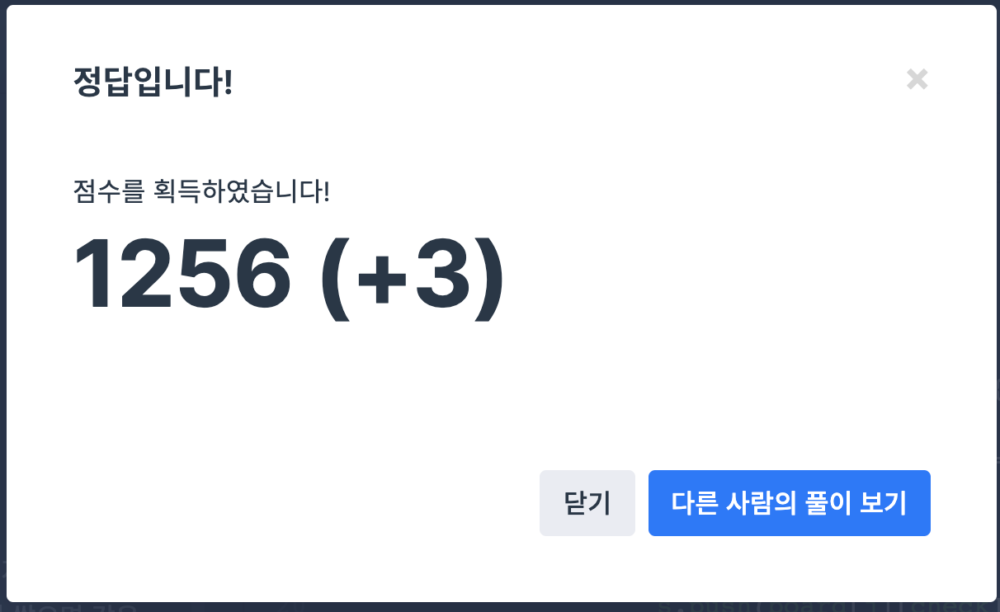

## 문제
- 프로그래머스 : 2019 카카오 개발자 겨울 인턴십 - 크레인 인형뽑기
- https://programmers.co.kr/learn/courses/30/lessons/64601

<br/>

## 풀이
- 탐색해야 할 `board` 의 x축은 `moves` 값이고 (`check` ), y축은 for문으로 차례대로 탐색한다.
- 탐색 결과 바구니에 넣어야 할 인형은 `stack` 에 넣어 `top` 값과 비교한다. 이 때 `top` 과 값이 같으면 인형을 터뜨린다.
- 처음에 stack 라이브러리를 사용하기 싫어 벡터에 넣는것을 고집했는데 스택이 이 문제 구현하기엔 훨씬 편하긴 하다.. ㅎㅎ


<br/>


## 코드

```c++
#include <string>
#include <vector>
#include <stack>

using namespace std;

int solution(vector<vector<int>> board, vector<int> moves) {
    int answer = 0;
    stack<int> s;
    
    for(int i=0; i<moves.size(); i++){
        int check = moves[i] - 1;
        
        for(int j=0; j<board.size(); j++){
            if(board[j][check] != 0){
                if(!s.empty() && s.top() == board[j][check]){
                    s.pop();
                    answer+=2;
                } else {
                    s.push(board[j][check]);
                }
                board[j][check] = 0;
                break;
            }
        }
    }
    
    return answer;
}
```

<br/>

## screenshot



