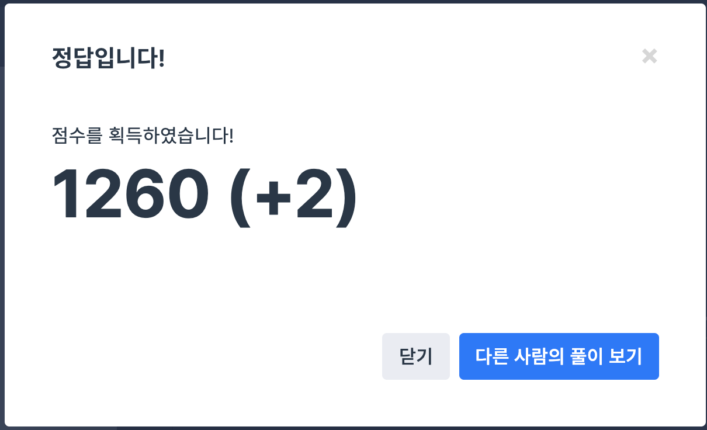

## 문제
- 프로그래머스 : 2020 카카오 인턴십 - 키패드 누르기
- https://programmers.co.kr/learn/courses/30/lessons/67256

<br/>

## 풀이
- 현재 왼손과 오른손의 좌표를 `coord` 구조체를 사용해 저장하는 것이 핵심이다.
- 번호를 누를 때마다 누른 손의 좌표를 반드시 update 해야 한다.

<br/>

## 코드

```c++
#include <string>
#include <vector>

using namespace std;

typedef struct coord {
    int x; 
    int y;
} Coord;

string solution(vector<int> numbers, string hand) {
    string answer = "";
    
    Coord left, right; // 왼손, 오른손 좌표 저장 
    left.y = 3; left.x = 0;
    right.y = 3; right.x = 2;
    
    for(int i=0; i<numbers.size(); i++){
        int num = numbers[i]; 
        
        if(num%3==1){ // 왼손 사용: 1,4,7
            answer += "L";
            left.x = 0;
            if (num==1) left.y = 0; 
            else if (num==4) left.y = 1; 
            else left.y = 2;
        } else if(num%3==0 && num!=0){ // 오른손 사용: 3,6,9
            answer += "R";
            right.x = 2;
            if (num==3) right.y = 0;
            else if (num==6) right.y = 1;
            else right.y = 2;
        } else { // 왼,오 사용: 2,5,8,0
            Coord tmp; tmp.x=1;
            if(num==2) tmp.y=0;
            else if (num==5) tmp.y=1;
            else if (num==8) tmp.y=2;
            else tmp.y=3;
            
            int leftDiff = abs(tmp.y-left.y) + abs(tmp.x-left.x);
            int rightDiff = abs(tmp.y-right.y) + abs(tmp.x-right.x);
            
            if(leftDiff < rightDiff){
                answer += "L";
                left.y = tmp.y; left.x = tmp.x;
            } else if (leftDiff > rightDiff){
                answer += "R";
                right.y = tmp.y; right.x = tmp.x;
            } else {
                if(hand=="left"){
                    answer += "L";
                    left.y = tmp.y; left.x = tmp.x;
                } else {
                    answer += "R";
                    right.y = tmp.y; right.x = tmp.x;
                }
            }
        }
    }
    return answer;
}
```

<br/>

## screenshot



