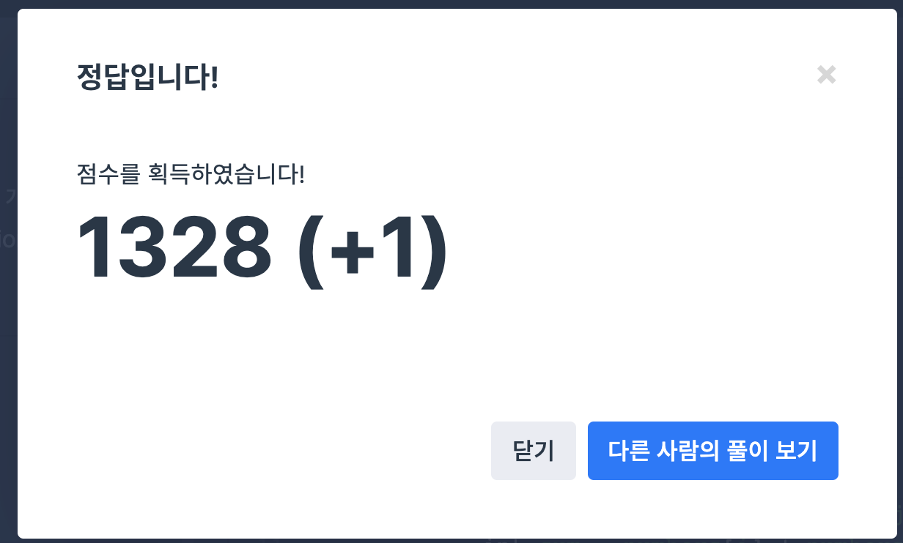

## 문제
- 프로그래머스 월간 코드 챌린지 시즌1 : 두 개 뽑아서 더하기
- https://programmers.co.kr/learn/courses/30/lessons/68644

<br/>

## 풀이
- 이중 for문 탐색을 사용해 서로 다른 두 개의 숫자를 뽑는다.

  ```c++
  for(int i=0; i<numbers.size(); i++){
    for(int j=i+1; j<numbers.size(); j++){
      // code
    }
  }
  ```

  이 때 각각 탐색 시작을 0, `i+1` 로 정한다.

- 정답 벡터에는 unique한 값만 들어가야 하므로 `iterator` 를 사용해 중복 여부를 검사하고, 중복이 없는 경우에만 push 한다.

- 마지막 정렬은 `sort()` 를 사용한다.


<br/>


## 코드

```c++
#include <vector>
#include <algorithm>

using namespace std;

vector<int> solution(vector<int> numbers) {
    vector<int> answer;
    
    for(int i=0; i<numbers.size(); i++){
        for(int j=i+1; j<numbers.size(); j++){
            int sum = numbers[i] + numbers[j];
            auto itr = find(answer.begin(), answer.end(), sum);
            if(itr==answer.end()){
                answer.push_back(sum);
            }
        }
    }
    
    sort(answer.begin(), answer.end());
    
    return answer;
}
```

<br/>

## screenshot




<br/>
