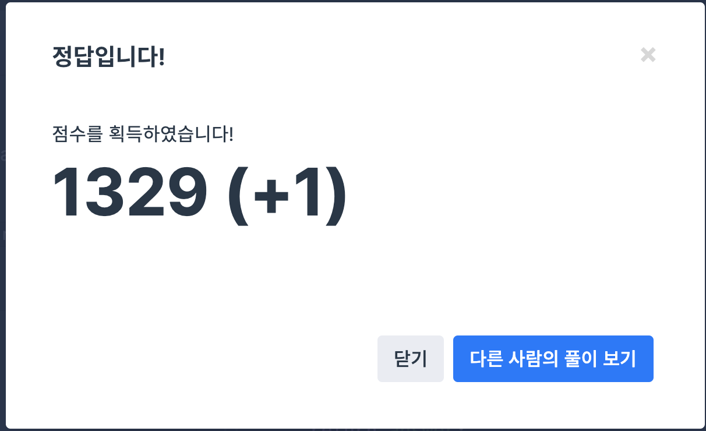

## 문제
- 프로그래머스 월간 코드 챌린지 시즌1 : 내적
- https://programmers.co.kr/learn/courses/30/lessons/70128

<br/>

## 풀이
- 풀이 적을 것도 없는 너무 간단한 문제. for문을 돌아 a와 b의 내적을 구한다.


<br/>


## 코드

```c++
#include <string>
#include <vector>

using namespace std;

int solution(vector<int> a, vector<int> b) {
    int answer = 0;
    for(int i=0; i<a.size(); i++){
        answer += a[i]*b[i];
    }
    return answer;
}
```

<br/>

## screenshot




<br/>
